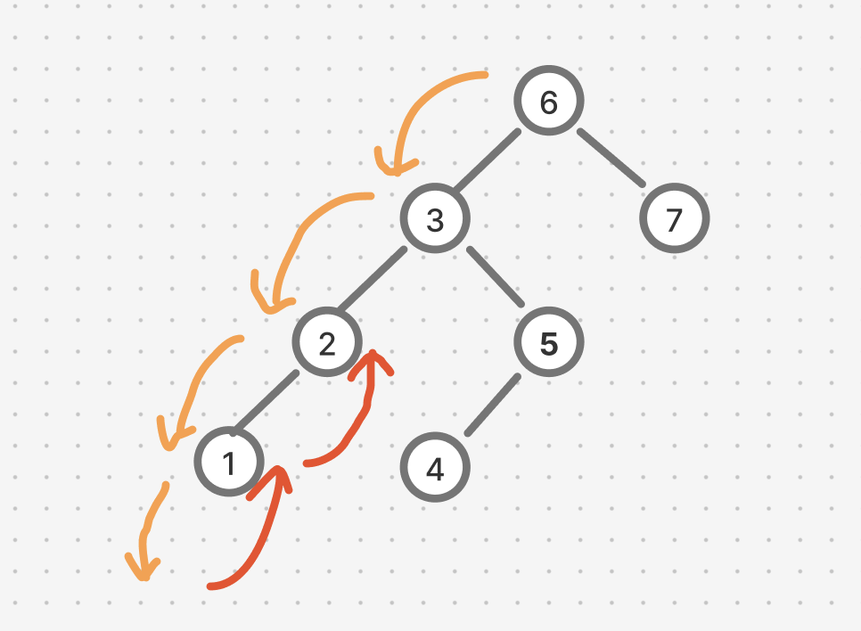

# 題目

https://leetcode.com/problems/binary-tree-inorder-traversal/description/

用迭代法實現（while loop）

# 開始分析

- 本題目背後的核心概念
  - 中序遍歷要如何拆解步驟？
    - 由於迭代法一定是從根開始，但中序遍歷必須先持續往左直到葉子節點才開始處理，所以需要從根開始持續把左孩子放到堆疊，之後按照 pop 順序處理。
    - pop 會先處理目前節點，然後嘗試放入右孩子。
    - 同步驟一，右孩子會被當作根節點，持續往左直到葉子節點才開始處理。
- 如何從問題推導出使用的解題工具
  - 用堆疊 Stack 的先進後出特性，可以模擬出遞迴的效果。
- 如何推導出最優複雜度
  - 訪問 N 個節點，時間複雜度 O(N)
  - 需要堆疊放置節點，所以空間複雜度為 O(N)

## 如何解釋解題思路

### 迭代法

中序遍歷的解法很多，但不管如何，因為我們會經過同個節點不止一次（如下示意圖），當在處理某個節點時，一定要有一個變數讓知道該迴圈應該

1. 持續將左孩子放入
2. 彈出並處理該節點，並將右孩子（如果有的話）放入


\# 橘色路徑為往左探底，會經過節點 2。  
\# 紅色路徑為探底完成後往回處理節點，也會經過節點 2。

最簡單的方法是一個布林值告訴我們每次迭代應該往下還是往上。如下虛擬碼：

```js
let stack = [],
  down = true;
while (stack.length > 0) {
  if (down) {
    // move left as possible
    // start to go up when reach end
  } else {
    // stack: pop and "handle" the top as possible
    // but, if a node has right child. start to go down
  }
}
```

題外話一下，由於網路上很多解法都是另外用一個指標 `current`，去同時記錄目前節點和 go up/down，我個人覺得有點像 one liner 一樣，雖然漂亮，但腦袋容易被混淆。所以兩種解法我都嘗試解釋。

##### 經分析後，本題詳細步驟如下：

1. 方向初始為向下，從根部開始遍歷。
   1. 方向如果為**向下**，且有左孩子，持續放入堆疊。直到左孩子為空，方向設為向上。
   2. 方向如果為**向上**，彈出堆疊尾節點並將值放入答案。
      1. 如果彈出的節點有右孩子，放入堆疊並將方向設為向下。停止繼續彈出。（自動前往步驟 1-1）
      2. 如果沒有，繼續彈出。
2. 直到堆疊為空，回傳答案。

時間複雜度：遍歷所有節點來回共兩次 -> O(2n) = O(n)  
空間複雜度：需要可以放置所有節點的堆疊 -> O(n)

#### 程式碼

- Javascript

```js
/**
 * @param {TreeNode} root
 * @return {number[]}
 */
var inorderTraversal = function (root) {
  if (!root) return [];
  const ans = [], stack = [root];
  let down = true;

  while (stack.length > 0) {
    if (down) {
      while (stack.at(-1).left) stack.push(stack.at(-1).left);
      down = false;
    } else {
      while (stack.length > 0) {
        const cur = stack.pop();
        ans.push(cur.val);
        if (cur.right) {
          stack.push(cur.right);
          down = true;
          break;
        }
      }
    }
  }
  return ans;
};
```

##### 附註，網路上更乾淨的解法：
`current`的解釋為：目前正在往下探索的節點。
所以如果目前沒有要往下探索的節點，就會開始彈出。
如果彈出途中，找到節點有右孩子的，則繼續開始往下探索（current 設為該右孩子）
```js
var inorderTraversal = function (root) {
  if (!root) return []
  const ans = [], stack = []
  let current = root

  while (current || stack.length > 0) {
    // Move down the left subtree
    while (current) {
        stack.push(current);
        current = current.left; // Navigate to left child
    }

    // Backtrack to the parent node
    current = stack.pop();
    ans.push(current.val); // Process the node

    // Move to the right child
    current = current.right;
  }
  return ans
}
```
