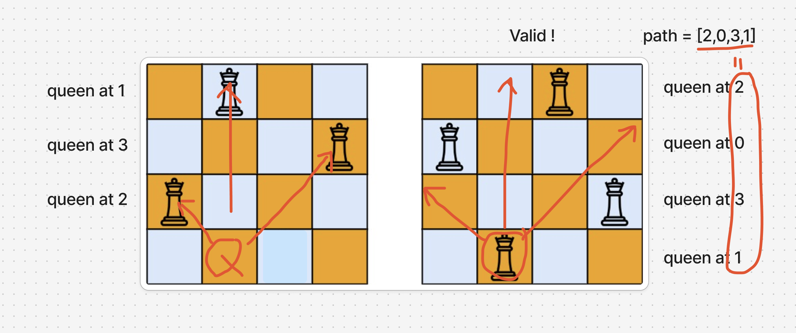

# 題目

https://leetcode.com/problems/n-queens-ii/description/

# 開始分析

- 本題目背後的核心概念
  - 符合回溯場景嗎？是，窮舉所有可能並加總數量
  - 決策樹寬度取決於何？某一行有幾個皇后的落腳點，最多為 n
  - 決策樹高度取決於何？棋盤有幾行可以放皇后，最多為 n
- 如何從問題推導出使用的解題工具
  - **背**：回溯模板
- 如何推導出最優複雜度
  - 時間複雜度：一行 n 個可能落腳點，總共 n 行-> O(n^n)  
  - 空間複雜度：紀錄路徑的陣列O -> O(n)

### 回溯法

##### 如何解釋解題思路

系統化解題的應用，非常標準回溯法。經過分析，for 迴圈的寬度取決於行寬，也就是 n，遞迴深度取決於行數也就是 n。

先完成回溯三定義：
1. 決定輸入：需紀錄目前深度和走過路徑
2. 決定終止條件：當深度為 n 時終止
3. 確定回溯邏輯：找到有效落腳點後繼續往下一行。

再來舉例子說明，假定為 3x3 的棋盤，首先在第一行隨意選擇一個有效位置後
再到第二行隨意選一個有效位置
最後再到第三行選擇有效位置。若能成功在每一行都給皇后找出一個落腳點，那該棋盤組成即為答案之一。窮舉所有組成並記錄組成數量，回傳為答案

線提棋盤大 n 乘 n ，決策樹寬度取決於我們要在某一行有幾個落腳點。對於 n 個可能落腳點我們一一驗證，如下：

```js
const backtrack = (level) => {
  for (let i = 0; i < n; i++) { // 嘗試所有落腳點
    if (isValid(i)) { // 無效則跳過，有效則放上皇后試試
      path.push(i);
      backtrack(level + 1);
      path.pop();
    }
  }
};
```

並且設定終止條件：若棋盤成功放上 n 個皇后（決策樹深度達到 n），記錄答案並終止。

```js
const backtrack = (level) => {
  // 終止條件
  if (level === n) {
    total++;
    return;
  }

  // 同前述
  for (let i = 0; i < n; i++) {
    if (isValid(i)) {
      path.push(i);
      backtrack(level + 1);
      path.pop();
    }
  }
};
```

結構搭出來了，接下來完成驗證 isValid 即可。首先可以觀察一下下圖 4X4 棋盤。

圖右邊是一個有效的，皇后不相交的答案組合之一。
左邊要放上 Q 要，檢驗延伸線和之前放的皇后不相交，基本朝三個方向檢查：上、斜左上、斜右上，如果在延伸線上沒有放皇后，那即可落腳。

而為了記錄之前的落腳點（回溯路徑），也必須有一個 path 陣列紀錄，總地來說程式碼為

```js
let path = [], total = 0;
const isValid = (queenPos) => {
  for (let i = 1; i <= path.length; i++) {
    const pos = path.at(-i); // 之前放置的其他皇后的位置
    // 是否在正上方、斜左上、斜右上
    if (queenPos === pos) return false;
    if (queenPos + i < n && queenPos + i === pos) return false;
    if (queenPos - i >= 0 && queenPos - i === pos) return false;
  }
  return true;
};

const backtrack = (level) => {
  if (level === n) {
    total++;
    return;
  }
  for (let i = 0; i < n; i++) {
    if (isValid(i)) {
      path.push(i);
      backtrack(level + 1);
      path.pop();
    }
  }
};
```

##### 經分析後，本題詳細步驟如下：

1. 橫向遍歷單一行所有可能落腳點 n 個，選下後前往下次遞迴
2. 每次選擇前，檢查所選位置是否有效
3. 選擇完後向下遞迴準備選擇下一行的落腳點
4. 遞迴完後退回該選擇
5. 每次遞迴開始前，檢查若已達深度 n ，記錄答案
6. 全部遞迴完成後，回傳答案總數

時間複雜度：O(n^n)  
空間複雜度：O(n)

#### 程式碼

- Javascript

```js
/**
 * @param {number} n
 * @return {number}
 */
var totalNQueens = function (n) {
  let path = [], total = 0;
  const isValid = (queenPos) => {
    for (let i = 1; i <= path.length; i++) {
      const pos = path.at(-i);
      if (queenPos === pos) return false;
      if (queenPos + i < n && queenPos + i === pos) return false;
      if (queenPos - i >= 0 && queenPos - i === pos) return false;
    }
    return true;
  };

  const backtrack = (level) => {
    if (level === n) {
      total++;
      return;
    }
    for (let i = 0; i < n; i++) {
      if (isValid(i)) {
        path.push(i);
        backtrack(level + 1);
        path.pop();
      }
    }
  };
  backtrack(0);
  return total;
};
```
