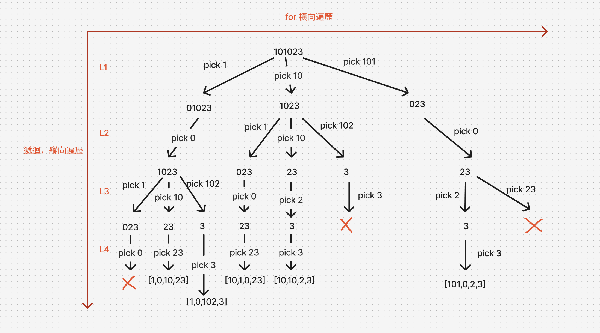

# 題目
https://leetcode.com/problems/restore-ip-addresses/description/

# 開始分析
- 本題目背後的核心概念
  - 符合回溯場景嗎？是，本題是窮舉所有集合。
  - 決策樹寬度取決於何？從開頭取 IP 字段(0~255) 有幾種取法？至多三種
  - 決策樹高度取決於何？總共要取幾個字段，固定為 4
- 如何從問題推導出使用的解題工具
  - **背**：回溯模板
- 如何推導出最優複雜度
  - 時間複雜度：IP 最多三位也就是單字段最多有三種選擇（樹寬度），總共選擇四段（高度）-> O(3^4)
  - 空間複雜度：需要紀錄路徑的陣列 -> O(n)
### 回溯

##### 如何解釋解題思路
回溯也有工具可用。首以 IP 字串 "101023" 為例，我畫出整個決策樹

再來利用回溯三定義：
1. 確定傳入參數：我們觀察縱向軸，發現每個 level 差在字段起始位置不一樣，因此我們傳入一個 startIndex。
2. 確定終止條件：當過了 L4 後終止
3. 確定單層邏輯：檢查所選字段是不是有效 IP，若有效則進行遞迴

##### 經分析後，本題詳細步驟如下：
1. 橫向遍歷所有選擇，選下後前往下次遞迴
2. 每次選擇前，檢查所選字段是否有效
3. 選擇完後向下遞迴準備選擇下一個字段
4. 遞迴完後退回該選擇
5. 每次遞迴開始前，檢查若已選字段數為4，且走訪完所有字元，則將答案放進結果集，並結束。

時間複雜度：O(3^4)   
空間複雜度：O(n)

#### 程式碼
- Javascript
```js
/**
 * @param {string} s
 * @return {string[]}
 */
var restoreIpAddresses = function(s) {
    const ans = [], path = []
    const backtrack = (start) => {
        if (path.length === 4 && start === s.length) {
            ans.push(path.join('.'))
            return
        }
        for (let end = start + 1; end <= s.length; end++) {
            if (s[start] === '0' && end !== start + 1) break // 開頭 0 的字段例如 "01" 無效
            const segment = s.slice(start, end)
            if (Number(segment) > 255) break // 超過範圍 0~255 的字段無效
            path.push(s.slice(start, end))
            backtrack(end)
            path.pop()
        }
    }
    backtrack(0)
    return ans
};
```
