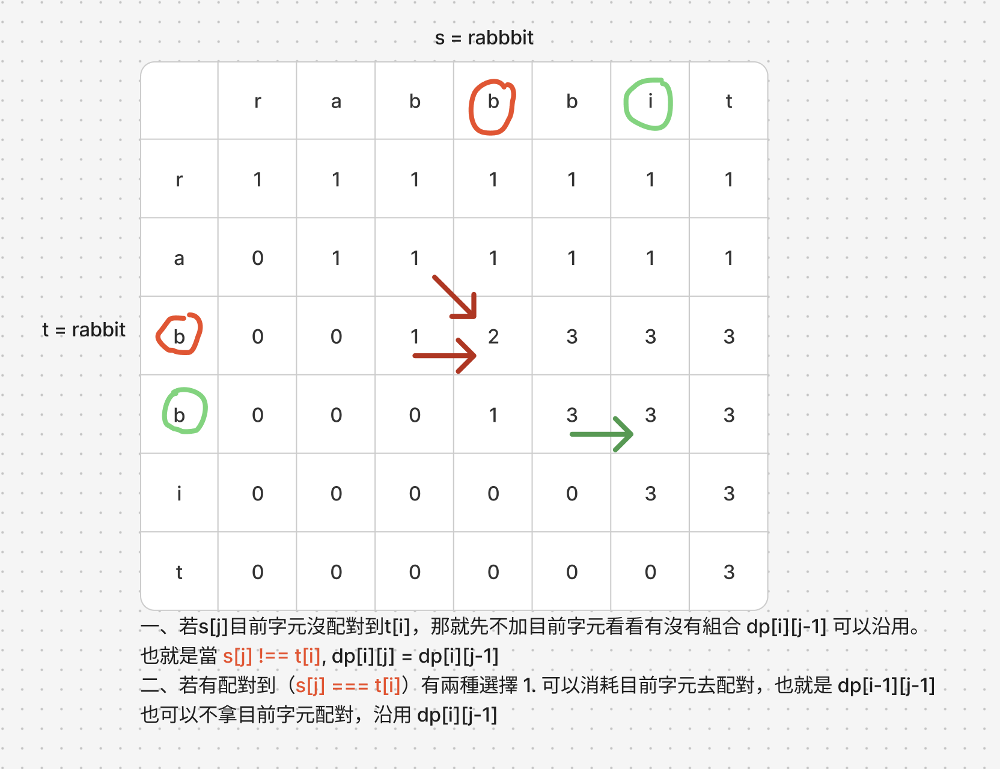
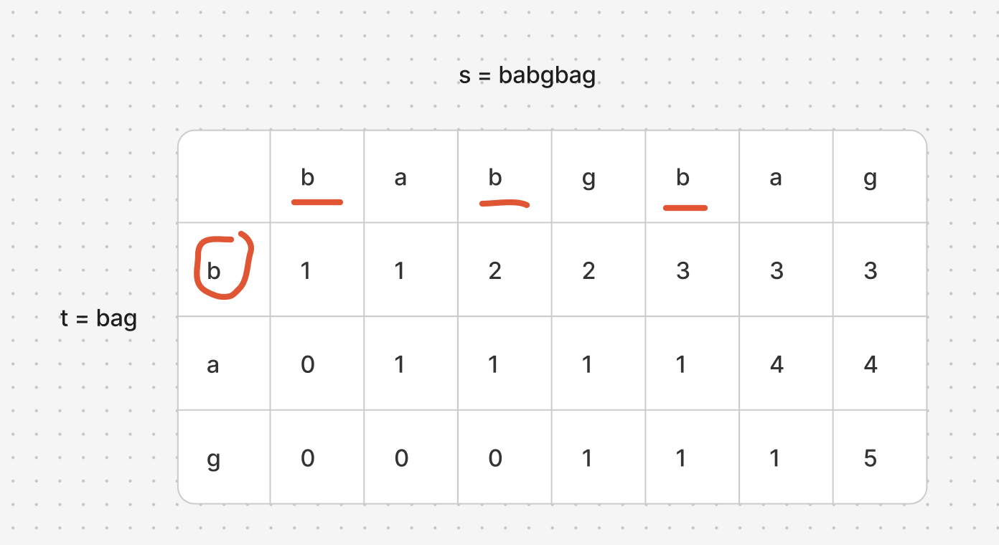

# 題目
https://leetcode.com/problems/distinct-subsequences/description/

# 開始分析
- 本題目背後的核心概念
- 如何從問題推導出使用的解題工具
- 如何推導出最優複雜度

### 動態規劃

##### 如何解釋解題思路

這題的狀態轉移要稍微想一下，但是定義子問題還是比較簡單的，只要碰到子序列相關問題，常常都是s和t兩個字串分別取0~i,0~j的位置作為結尾，這題也不例外。

先定義後我們再繼續往下，子問題：dp[i][j] = x，用s從0開始以位置j結尾的字串，組合成t以0開始i結尾的子序列有x種組法。

如下圖，我們可以先把DP陣列數字填上再開始觀察，乍看之下屬於先射箭再畫靶的思考路徑雖然不太正統，但因為我們已經先定義了子問題，對「狀態轉移公式」就算毫無頭緒也能依照題意先填完表格，再來觀察狀態怎麼轉移的。


可以觀察到若字元t[i]、s[j]不相等，則dp[i][j]，沿用dp[i][j-1]位置的值（從左邊來）。若相等則從 dp[i-1][j-1]加上dp[i][j-1]而來。
不相等可以沿用那是因為，舉例來說當t=ab"c",s=abc"e"，若目前字元c、e不相等，我們還是可以把e去掉並且沿用abc比對abc的結果
而若相等，舉例來說當t=ab"c",s=abc"c"，我們不只能沿用abc比對abc的結果，我們還能因為比對成功而去消耗t尾端的c，也就是能沿用abc比對ab的結果

最後第一行要先初始化，初始化的方法在下面例子可以看到，在s之中如果多次出現t[0]字元，那組合也就有多種，所以初始化並非都是1


1. 定義DP含義：dp[i][j] = x，用s從0開始以位置j結尾的字串，組合成t以0開始i結尾的子序列有x種組法。
2. 定義狀態轉移：
    - 若字元t[i]、s[j]不相等，dp[i][j] = dp[i][j-1]
    - 若不相等，dp[i][j] = dp[i][j-1] + dp[i][j-1]
3. 由 t[0]出現在s中的次數初始化第一行
3. 遍歷順序s、t都是由小到大

##### 經分析後，本題詳細步驟如下：

時間複雜度：  
空間複雜度：

#### 程式碼
- Javascript
```js
var numDistinct = function (s, t) {
    const dp = Array(t.length).fill().map(() => Array(s.length).fill(0))
    let matched = 0
    for (let i = 0; i < s.length; i++) {
        if (s[i] === t[0]) matched++
        dp[0][i] = matched
    }
    for (let i = 1; i < t.length; i++) {
        for (let j = 1; j < s.length; j++) {
            if (s[j] !== t[i]) dp[i][j] = dp[i][j - 1]
            else dp[i][j] = dp[i - 1][j - 1] + dp[i][j - 1]
        }
    }
    return dp.at(-1).at(-1)
};
```
