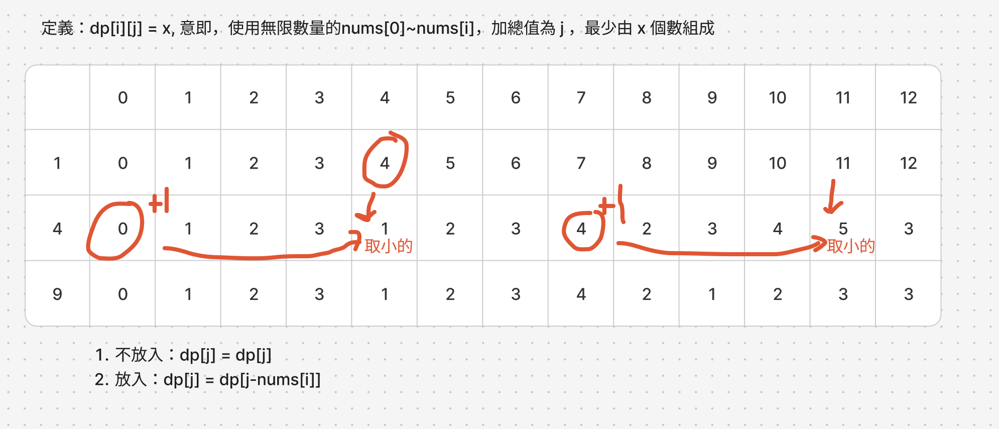

# 題目
https://leetcode.com/problems/perfect-squares/description/

# 開始分析
- 本題目背後的核心概念
  - 能否拆分為子問題？是，本題可以拆分為物品可重複使用的「完全背包問題」
- 如何從問題推導出使用的解題工具
  - 利用動態回歸定義四步驟
  - 背包問題的思路
- 如何推導出最優複雜度
  - 時間複雜度：m為平方數數量，n 為總和 -> O(mn)
  - 空間複雜度：需要 dp[m][n] 大小的空間 -> O(mn)

### 動態規劃

##### 如何解釋解題思路

將問題稍作轉化，其實就是我們挑出所有小於等於 n 的平方數，以 n = 12為例，我們挑出，平方數 nums = [1,4,9]，並且我們任意組合平方數，組成12，例如4+4+4、1+1+1+9。看我們如何能用最少的數字去組成，例如4+4+4用了三個數，那就是更好的組成（因為用的更少）

因此轉化後本題屬於完全背包問題，是建構於0/1背包問題之上，適用情景是要將不同重量的物品0~m，放入總承重為n的背包，每個物品都有無限個，可以用來求在不塞爆背包的情況下的下列解答：1.最多能放入多少物品, 2.剛好裝滿幾種有幾種組合。

我們要找的是，任意取用[1,4,9]並剛好裝滿容量為12的「背包」組合中使用數字個數最少的。

如下圖，我們嘗試定義和走完狀態轉換一次，新狀態由「放入」與「不放入」目前平方數兩種情況轉換來


知道思路後我們直接進行動態回歸定義四步驟：
1. 定義描述：dp[i][j] = x，意即使用無限數量的 nums[0]~nums[i]去組成j，最少會需要 x 個數字組成
2. 狀態轉換規則：對於物品0~i，狀態轉換為放入目前物品i或不放入，若不放入則沿用i-1時用的組合，若放入則數字量為 dp[i][j - nums[i]] + 1，接著比較兩種情況誰用的數字少
3. 初始化：dp[m][n]，先都是0，然後第一行dp[0]用nums[0]初始化，j >= 用nums[0]的都設為 dp[0][i - nums[0]] + 1
4. 遍歷順序：平方數從0 ~ i、總數由小至大0 ~ n


##### 經分析後，本題詳細步驟如下：
1. 找出所有小於n的平方數，放入nums
1. 初始化dp[m][n]，並且初始化第一行 d[0][0~n]當作基礎情況
2. 外層由上至下遍歷平方數 nums ，內層由小至大遍歷總數 n
3. 每次遍歷，對於放入與不方入nums[i]的值取較小的（一定義來說就是組成數最少）
4. 回傳dp最後最後一行最後一列為答案

時間複雜度：O(mn)  
空間複雜度：O(mn)
#### 程式碼
- Javascript
```js
var numSquares = function (n) {
    const nums = [1]
    for (let i = 2; i ** 2 <= n; i++) nums.push(i ** 2)
    const dp = Array(nums.length).fill().map(() => Array(n + 1).fill(0))
    for (let i = nums[0]; i <= n; i++) dp[0][i] = dp[0][i - nums[0]] + 1

    for (let i = 1; i < nums.length; i++) {
        for (let j = 1; j <= n; j++) {
            if (j >= nums[i]) dp[i][j] = Math.min(dp[i - 1][j], dp[i][j - nums[i]] + 1)
            else dp[i][j] = dp[i - 1][j]
        }
    }
    return dp[nums.length - 1][n]
};
```
