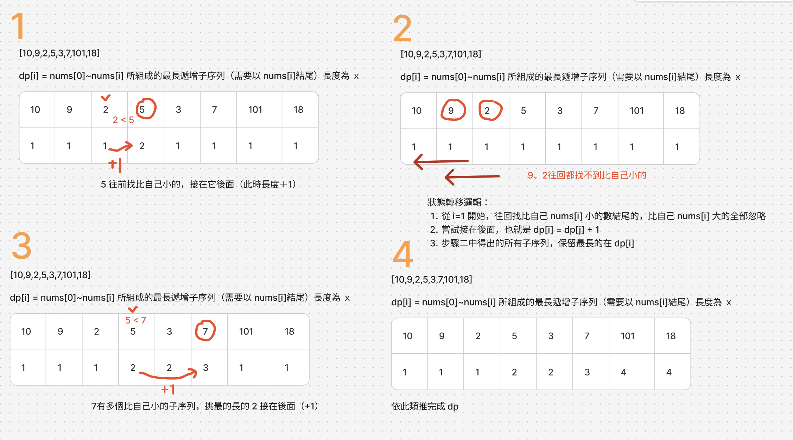

# 題目
https://leetcode.com/problems/longest-increasing-subsequence/description/

# 開始分析
- 本題目背後的核心概念
- 如何從問題推導出使用的解題工具
- 如何推導出最優複雜度

### 動態規劃

##### 如何解釋解題思路

因為這題數字可以跳著選沒必要連續，暴力法會變成 2^n，因為每個數字都有選/不選兩種選擇，所以四個數字總共有 2x2x2x2 個有效選擇。如果 n 很大那就爆了跑個幾十分鐘都有可能。

暴力法行不通，切切看子問題，這題的思路其實就是針對每一個數nums[i]，往回找看看有沒有子序列我可以接在後面的。每個都接接看就能找到最長的了

以下用 [10,9,2,5,3,7,101,18] 為例完整遍歷



1. 定義為，dp[i] = x, nums[0]~nums[i] 所組成的最長遞增子序列（需要以 nums[i]結尾）長度為 ｘ
2. 往前找，從 nums[0]~nums[i-1] 找比自己小的接在後面試試，每個都接接看看哪個長
3. dp[0]~dp[n] 先初始化為1，因為最小序列也得包含自己
4. 由左至右遍歷

##### 經分析後，本題詳細步驟如下：


時間複雜度：  
空間複雜度：

#### 程式碼
- Javascript
```js
/**
 * @param {number[]} nums
 * @return {number}
 */
var lengthOfLIS = function (nums) {
    const dp = Array(nums.length).fill(1)
    for (let i = 0; i < nums.length; i++) {
        for (let j = 0; j < i; j++) {
            if (nums[i] > nums[j]) dp[i] = Math.max(dp[i], dp[j] + 1)
        }
    }
    return Math.max(...dp)
};
```
