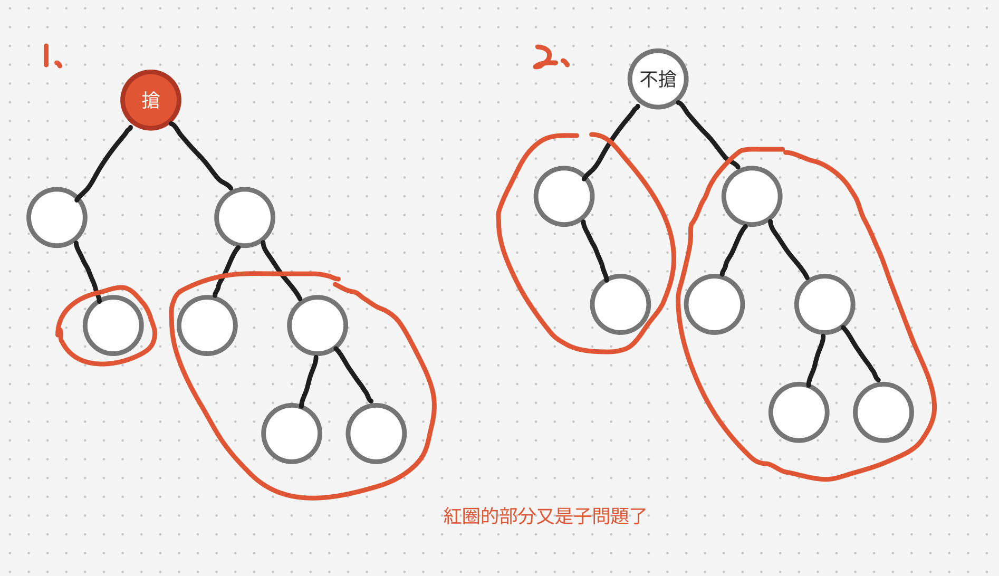

# 題目
https://leetcode.com/problems/house-robber-iii/

# 開始分析
- 本題目背後的核心概念
  - 何種遍歷方法？需要先運算子樹的最大贓款，所以為後序遍歷
  - 可否拆解子問題？是，拆解成「搶」與「不搶」兩種選項
- 如何從問題推導出使用的解題工具
  - 動態回歸四定義、遞迴三定義
- 如何推導出最優複雜度
  - 時間複雜度：遍歷所有節點 -> O(n)
  - 空間複雜度：用 hash要 O(n)，用狀態轉移 O(1)

### 動態規劃
##### 如何解釋解題思路
這題和 198.House Robber是有點像的，只是本題是在樹上切割子問題。

對於任意節點，我們都可以選擇搶、不搶。並且在做了選擇之後，將有可能繼續被搶的節點再當成子問題（需要排除不可能被搶的節點）

如下圖，例子1，我們搶了根節點，這時候只剩孫子節點有可能被搶（紅色圈起部分）。而例子二，若我們選擇不搶，則孩子節點繼續作為子問題。



邏輯如下，每個節點，取搶和不搶的較大值
```js
const dfs = (node) => {
  if (!node) return 0
  const robCur = dfs(node.left?.left) + dfs(node.left?.right) + 
        dfs(node.right?.left) + dfs(node.right?.right) + node.val
  const passCur = dfs(node.left) + dfs(node.right)
  return Math.max(robCur, passCur)
}
```
邏輯確定了，至於要如何避免重複計算的部分，可以用 hashMap 做 cache，如下

```js
var rob = function (root) {
    const hash = new Map()
    const dfs = (node) => {
        if (hash.has(node)) return hash.get(node)
        if (!node) return 0
        // 搶目前節點和孫子們
        const robCur = dfs(node.left?.left) + dfs(node.left?.right) + 
                dfs(node.right?.left) + dfs(node.right?.right) + node.val
        // 不搶目前節點，搶孩子們
        const passCur = dfs(node.left) + dfs(node.right)
        const result = Math.max(robCur, passCur)
        hash.set(node, result)
        return result
    }
    return dfs(root)
};
```

也可以更改dfs回傳值避免重複計算，同時回傳目前節點被「搶」與「不搶」的贓款，這樣更像DP在紀錄狀態轉移

這邊我們要用遞迴三定義或是動態規劃四定義都可以，之前說過本質上可以互通，那我們就融合兩者概念，用遞迴三定義定義狀態轉移：
1. 定義輸入輸出：給定樹根，回傳「考慮被搶」與「不搶」此樹根的最大贓款，回傳陣列
2. 定義終止條件：若樹根為空，回傳[0,0]
3. 定義具體邏輯：先算出「考慮搶」與「不搶」左右孩子的贓款，然後依此算出「考慮搶」與「不搶」本節點的最大贓款並回傳

##### 經分析後，本題詳細步驟如下：
1. 後序遍歷所有節點，每次遍歷，計算並回傳目前節點搶、不搶兩種情況各自的贓款
2. 若搶，則用節點本身值，加上「不搶」左右孩子（搶孫子樹）得到的贓款
3. 若不搶，則回傳「考慮搶」左右子樹得到的贓款
4. 最終回傳為陣列，對跟節點的[考慮搶，不搶]，取其中最大值即為答案

時間複雜度：O(n)  
空間複雜度：O(1)

#### 程式碼
- Javascript
```js
var rob = function(root) {
  const dfs = (node) => {
    if (!node) return [0,0]
    const [robLeft, passLeft] = dfs(node.left)
    const [robRight, passRight] = dfs(node.right)
    const robCur = passLeft + passRight + node.val
    const passCur = Math.max(robLeft, passLeft) + Math.max(robRight, passRight)
    return [robCur, passCur]
  }
  return Math.max(...dfs(root))
};
```
