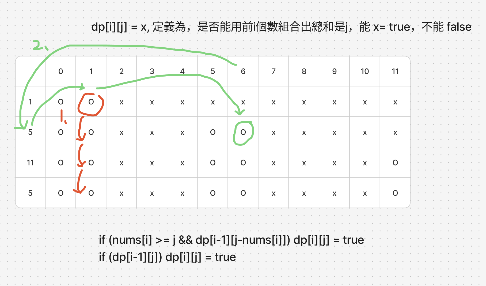

# 題目
https://leetcode.com/problems/partition-equal-subset-sum/description/

# 開始分析
- 本題目背後的核心概念
  - 能否拆分為子問題？是，拆解為0/1背包問題（背包容量固定 x，物品0~n擁有不同價值且佔去不同容量，任選物品，背包是否能被裝滿）。
- 如何從問題推導出使用的解題工具
  - 利用動態回歸定義四步驟
  - 背包問題的思路
- 如何推導出最優複雜度
  - 時間複雜度：m是數字陣列的總和，n是陣列長度。而對於所有n個數字，需要嘗試裝滿 0~m 的包包（組合出 0~m 的數字） -> O(mn)
  - 空間複雜度：用DP儲存上述結果 -> O(mn)

### 動態規劃

##### 如何解釋解題思路
以[1,5,11,5]舉例，要將陣列拆成兩個總和想等的子集，也就是拆成總和為11的子集。因為陣列總和為22所以兩個子集都要是11

這題也可以用回溯窮舉所有組合，能找到答案但會超時，時間複雜度是O(2^n)

所以我們將重心放在拆解背包問題，本題實際上就是容量為11（也就是sum/2）的背包，能不能用陣列內的數字`[1,5,11,5]`去裝滿的「0/1背包問題」

在背包問題中我們需要從容量 1,2,3...一直嘗試到容量11
我們也需要將物品從1,5,11,5按順序逐步加入選項

舉例來說一開始會問：數字1能否裝滿容量1的包包？  
再來會問數字1能否裝滿容量1的包包...問完數字1之後，加入數字5  
再問：數字1,5能否裝滿容量1的包包、數字1,5能否裝滿容量2的包包
...依此類推問到數字1,5,11,5能否裝滿容量11的包包即可得到答案


知道流程了，那首先嘗試DP四定義：
1. dp[i][j] = x, 定義為用物品 0~i，能不能裝滿容量 j 的包包，能的話 x= true，不能 x = false
2. dp 狀態轉移規則下面會列兩點，先跳過
3. dp中，j = 0全部是 true，因為什麼都不選可以組成容量0，再來如果`nums[0]`小於target，要先拿出來當初始狀態`dp[0][nums[0]] = true`，其餘都是 false
4. 遍歷順序是由上至下（物品慢慢增加），由左至右（容量慢慢增加）

現在解釋 dp 狀態轉移規則（可以配圖看比較懂），基本上就是每次遞迴對新增的物品決定放入或不放入：
1. 不放入：若少了i已能組成j，也就是 i-1本來就能組成 j，那dp[i][j]一定是true
2. 放入：若j減去物品i剩下的容量是能被裝滿的，說明i放進去後仍是滿的，是true

以上推演細品一下，圖中為詳細dp舉例

##### 經分析後，本題詳細步驟如下：
1. 加總數字並除以2做為最大容量，並創建大小為 dp[數字個數][最大容量+1] 的陣列，初始值都是 false
2. 初始化第一列為true，還有若nums[0]小於target，dp[0][nums[0]] = true
3. 由上至下，由左至右遍歷。每次遍歷，考慮放入i與不放入i兩種情況是否能裝滿
4. 遍歷結束，最後`dp.at(-1).at(-1)`即為答案


時間複雜度：O(mn)  
空間複雜度：O(mn)

#### 程式碼
- Javascript
```js
var canPartition = function (nums) {
    const sum = nums.reduce((acc, cur) => acc + cur, 0)
    if (sum % 2 === 1) return false
    const target = sum / 2
    const dp = Array(nums.length).fill().map(() => Array(target + 1).fill(false))
    for (let i = 0; i < nums.length; i++) dp[i][0] = true
    if (nums[0] <= target) dp[0][nums[0]] = true
    for (let i = 1; i < nums.length; i++) {
        for (let j = 1; j <= target; j++) {
            if (nums[i] <= j && dp[i - 1][j - nums[i]]) dp[i][j] = true
            if (dp[i - 1][j]) dp[i][j] = true
        }
    }
    return dp.at(-1).at(-1)
};
```
