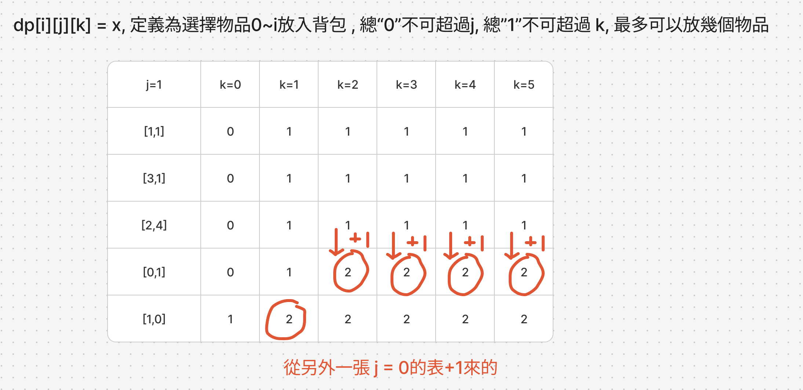

# 題目
https://leetcode.com/problems/ones-and-zeroes/

# 開始分析
- 本題目背後的核心概念
  - 能否拆分為子問題？是，不只能拆分為0/1背包問題，還是雙重維度的背包
- 如何從問題推導出使用的解題工具
  - 利用動態回歸定義四步驟
  - 背包問題的思路
- 如何推導出最優複雜度
  - 時間複雜度：k為物品總數（strs長度），對於兩個維度m, n算出所有dp[k][m][n] -> O(kmn)
  - 空間複雜度：需要 dp[k][m][n] 大小的空間 -> O(kmn)

### 動態規劃

##### 如何解釋解題思路
仔細觀察如何轉為背包問題，其中一個字串："0001"，是3個0，1個1。而所有字串的0總和不能超過m，1總和不能超過n

參數 strs 稱為物品，上限m, n看為背包容量，即可看成「0/1背包問題」

也就是在物品盡量多塞的前提下，"0"總數不超過背包容量m, "1"總數不超過背包容量ｎ的雙維度背包問題。

首先先嘗試將 "0001" 轉成 [3,1]代表0,1的數量。（變數 weight 儲存），我們以範例["10","0001","111001","1","0"]填表試試，先轉成`[[1,1], [3,1], [2,4], [0,1], [1,0]]`

可以看到三維的比較難畫圖用一張表來表示...這也是理解的難點之一。所以這題我們直接先定義，不懂的人可以自行在卡住的地方畫表。

我們直接進行動態回歸定義四步驟：

1. 定義是 dp[i][j][k] = x, 任選所有物品0~i，"0"的總數不超過m, "1"的數量不超過n，放進背包最多物品的數量是 x
2. 對於物品0~i，狀態轉換為放入目前物品i或不放入，若不放入則與i-1時所佔容量一樣(dp[i - 1][j][k])。若放入，則需要扣掉該物品所佔的0,1數量，也就是 dp[i - 1][j - weight[i][0]][k - weight[i][1]] + 1
3. 初始化dp，將weight[0]放得下的j, k都給1，其餘給0
4. 遍歷順序i由小至大、j由小至大、k由小至大
##### 經分析後，本題詳細步驟如下：
1. 將strs轉為[zeroCount, oneCount]這種weight格式的陣列
2. 宣告dp大小，所有值初始化為0
3. i=0時，裝得下weight[0]物品的所有j/k都設為1
4. i由小至大、j由小至大、k由小至大遍歷
5. 遍歷時，對於目前物品選擇加入/不加入後的物品總數，取其最大值
6. 三圍全部遍歷完後，dp.at(-1)[m][n]即為答案

時間複雜度：O(kmn)  
空間複雜度：O(kmn)

#### 程式碼
- Javascript
```js
const count01 = (str) => {
    let zero = 0, one = 0
    for (const char of str) {
        if (char === '0') zero++
        else if (char === '1') one++
    }
    return [zero, one]
}

var findMaxForm = function (strs, m, n) {
    const weight = strs.map(str => count01(str))
    const dp = Array(weight.length).fill().map(() => Array(m + 1).fill().map(() => Array(n + 1).fill(0)))
    for (let j = 0; j <= m; j++) {
        for (let k = 0; k <= n; k++) {
            if (j >= weight[0][0] && k >= weight[0][1]) dp[0][j][k] = 1
        }
    }
    for (let i = 1; i < weight.length; i++) {
        for (let j = 0; j <= m; j++) {
            for (let k = 0; k <= n; k++) {
                if (j >= weight[i][0] && k >= weight[i][1]) {
                    dp[i][j][k] = Math.max(dp[i - 1][j][k], dp[i - 1][j - weight[i][0]][k - weight[i][1]] + 1)
                } else {
                    dp[i][j][k] = dp[i - 1][j][k]
                }

            }
        }
    }
    return dp.at(-1)[m][n]
};
```
