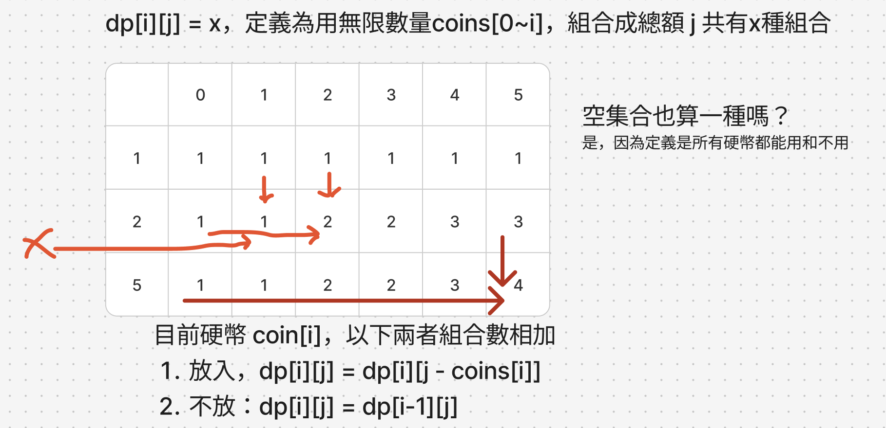

# 題目
https://leetcode.com/problems/coin-change-ii/description/

# 開始分析
- 本題目背後的核心概念
  - 能否拆分為子問題？是，本題可以拆分為物品可重複使用的「完全背包問題」
- 如何從問題推導出使用的解題工具
  - 利用動態回歸定義四步驟
  - 背包問題的思路
- 如何推導出最優複雜度
  - 時間複雜度：m為硬幣種類，n為總額 -> O(mn)
  - 空間複雜度：需要 dp[m][n] 大小的空間 -> O(mn)

### 動態規劃

##### 如何解釋解題思路
以`amount = 5, coins = [1,2,5]`來說，我們有三種硬幣，面額分別為1,2,5，每一種都有無限個，找出所有總額等於5的組合

本題屬於完全背包問題，是建構於0/1背包問題之上，適用情景是要將不同重量的物品0~m，放入總承重為n的背包，每個物品都有無限個，可以用來求在不塞爆背包的情況下的下列解答：1.最多能放入多少物品, 2.剛好裝滿幾種有幾種組合。

翻譯過來就是，我們要在硬幣[1,2,5]中任挑，然後剛好總額等於5的組合有幾種。

下面先建DP並畫個圖，可以看到從coins[0],coins[1]...等等，每次有新硬幣加入選項，都有「放與不放」兩種選擇，我們只要將兩種情況的組合數相加，就會得到新的總數。持續這樣的狀態轉移，最終所有硬幣和所有總額都算過一遍就會得到答案。

我們直接進行動態回歸定義四步驟：
1. 定義描述：dp[i][j] = x，定義是用無限數量coins[0~i]，組合成總額 j，共有x種組合 
2. 狀態轉換規則：對於物品0~i，狀態轉換為放入目前物品i或不放入，若不放入則與i-1時所佔容量一樣(dp[i - 1][j][k])。若放入，則需要扣掉該物品所佔的0,1數量，也就是 dp[i - 1][j - weight[i][0]][k - weight[i][1]] + 1
3. 初始化：dp[m][n]，先都是0，然後第一行dp[0]用coins[0]初始化，j >= coins[0]的都設為1
4. 遍歷順序：硬幣從0 ~ i、總額由小至大0 ~ n

##### 經分析後，本題詳細步驟如下：
1. 初始化dp[m][n]，並且初始化第一行 d[0][0~n]當作基礎情況
2. 外層由上至下遍歷 coins，內層由小至大遍歷 amount
3. 每次遍歷，加總「放入」與「不放入」兩種情況的組合數
4. 回傳dp最後最後一行最後一列為答案

時間複雜度：O(mn)  
空間複雜度：O(mn)

#### 程式碼
- Javascript
```js
var change = function (amount, coins) {
    const dp = Array(coins.length).fill().map(() => Array(amount + 1).fill(0))
    for (let i = 0; i < coins.length; i++) dp[i][0] = 1
    if (amount >= coins[0]) for (let i = coins[0]; i <= amount; i++) dp[0][i] = dp[0][i - coins[0]]
    for (let i = 1; i < coins.length; i++) {
        for (let j = 1; j <= amount; j++) {
            dp[i][j] = dp[i - 1][j]
            if (j >= coins[i]) dp[i][j] += dp[i][j - coins[i]]
        }
    }
    return dp.at(-1)[amount]
};
```
