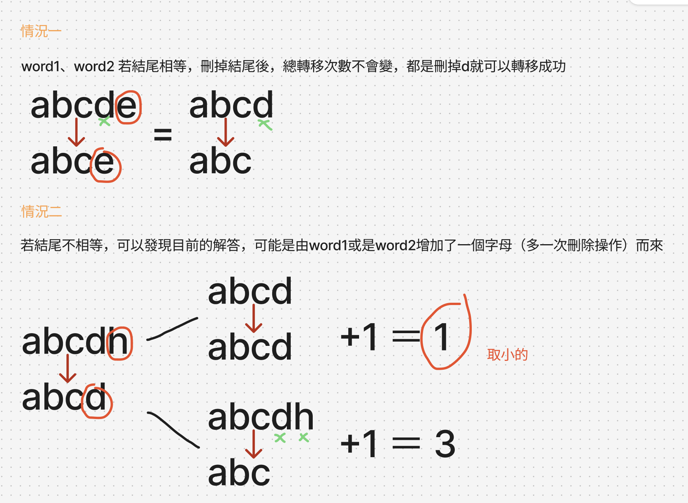
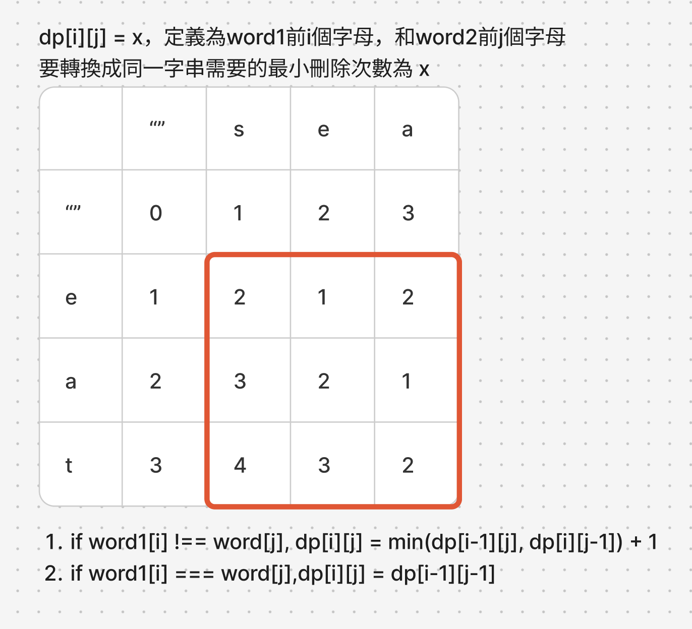

# 題目
https://leetcode.com/problems/delete-operation-for-two-strings/description/

# 開始分析
- 本題目背後的核心概念
- 如何從問題推導出使用的解題工具
- 如何推導出最優複雜度

### 動態規劃

##### 如何解釋解題思路

這題和1143.LCS十分類似，但這題word1，和word2都可以刪除，不像1143只有text1能刪。
因此可以感覺出狀態轉移可能會從兩個方向來。

先系統性的思考問題，舉例 word1="sea"是否能由word1="se"轉移而來，答案是可以的只要新增"a"，所以 word2要轉移到"sea"的次數，會和轉移到"se"需要的次數存在1的偏移量。
同樣的偏移量關係也發生在word2和"eat"還有"ea"。
所以我們可以任意移除尾部字元，只要在偏移量上面增減就好。

我下面針對結尾相等與不相等都舉個例子，可以看到我們可以任意刪除、新增字尾，偏移量都可以算出來。

p.s. 因為目的是要使word1和word2匹配，所以刪、新增其實是同一動作，也就是偏移量也是同義。



可以看到若結尾不同，目前的偏移量，則有可能word1=abcdh，是從abcd來的。或也有可能word2=abcd是從abc來的。我們取偏移量小的即可

到此可以定義DP含義：
dp[i][j] = x，定義為，word1前i個字母，和word2前j個字母，要轉換成同一字串需要的最小刪除次數為x。

這邊有個非常重要的手法是，比起從length = 1開始定義，去定義空字串的初始值做為基礎狀態更合理，也不用去檢查相等性。
- dp[0][0....j]給值 0,1,2,3,4...以此類推
- dp[i][0]也給值 0,1,2,3,4...以此類推

DP陣列填完如下圖，可以看到紅匡內才是我們要計算的狀態，其他都是初始化



##### 經分析後，本題詳細步驟如下：

時間複雜度：word1長度n，word2長度m，總共O(mn)  
空間複雜度：O(mn)

#### 程式碼
- Javascript
```js
/**
 * @param {string} word1
 * @param {string} word2
 * @return {number}
 */
var minDistance = function (word1, word2) {
    const dp = Array(word1.length + 1).fill(0).map(() => Array(word2.length + 1).fill(0))
    for (let i = 1; i < word1.length + 1; i++) {
        dp[i][0] = i
    }
    for (let i = 1; i < word2.length + 1; i++) {
        dp[0][i] = i
    }
    for (let i = 1; i <= word1.length; i++) {
        for (let j = 1; j <= word2.length; j++) {
            if (word1[i - 1] === word2[j - 1]) dp[i][j] = dp[i-1][j-1]
            else dp[i][j] = Math.min(dp[i-1][j], dp[i][j-1]) + 1
        }
    }
    return dp.at(-1).at(-1)
};
```
