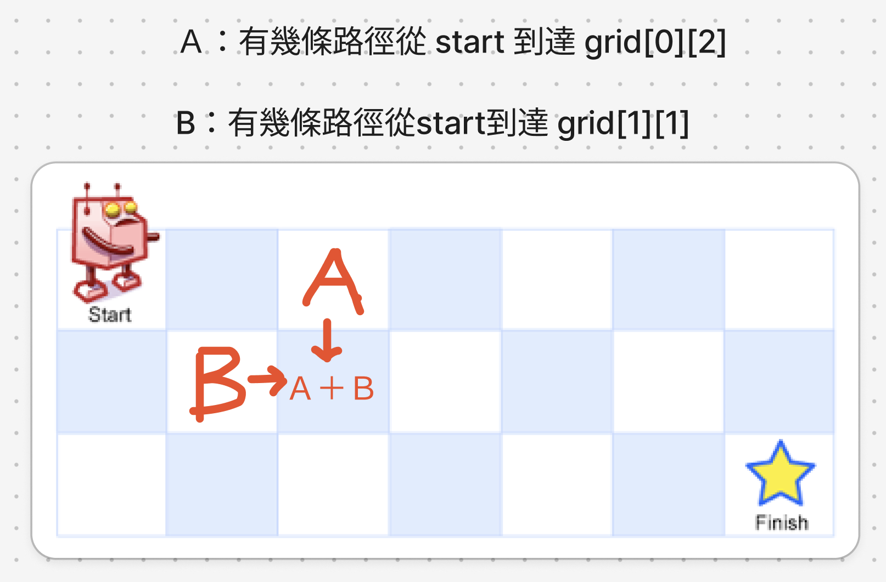
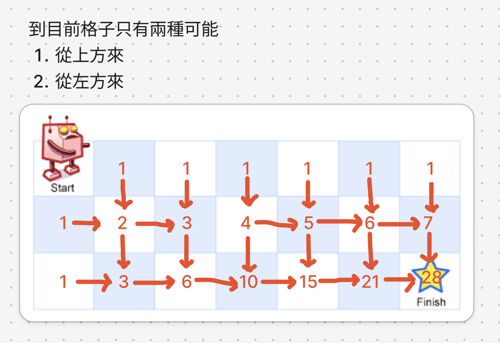

# 題目

https://leetcode.com/problems/unique-paths/description/

# 開始分析

- 本題目背後的核心概念
  - 可否拆解成子問題？可以，目前格子的路徑數來自上方和左方的路徑數總和
- 如何從問題推導出使用的解題工具
  - 利用動態回歸定義四步驟
- 如何推導出最優複雜度
  - 遍歷每個格子 -> O(mn)
  - 建立二維dp陣列 -> O(mn)

### 動態規劃

##### 如何解釋解題思路
DP問題首先要判斷能否拆解成子問題，若能，再開始用DP四定義。我們可以看到任意格子的路徑總和由上方和左方總和而來，故能拆解成子問題。


另外，動態規劃的題目完全可以轉換成遞迴的形式，如下是本題的遞迴版解法。所以遞迴最重要的「定義輸入與輸出」在動態規劃仍然也是必做事項，大多數題目，定義完輸入輸出也差不多解完了。而在動態規劃裡，下標就是輸出，存的值就是輸出。

```js
var uniquePaths = function (row, col) {
  if (row === 1 || col === 1) return 1
  return uniquePaths(row - 1, col) + uniquePaths(row, col - 1)
};

uniquePaths(7,3)
```

回到動態規劃，既然確定能用動規，那我們先完成DP四定義：

1. 定義dp下標和值的含義：dp[i][j]定義為，總共幾條路徑從 grid[0][0] 到 grid[i][j]
2. 確定推演公式：dp[i][j] = dp[i-1][j] （來自上方）+ dp[i][j-1]（來自左方）
3. dp 初始化：將第一行初始為 1, 還有第一列初始為 1
4. 確定遍歷順序：上方要先有值，左方要先有值才能推演成功。所以順序是由上至下，由左至右

再舉例 m = 7, n = 3，嘗試初始化與推演：

最後算出到達星星位置的路徑數為28。

##### 經分析後，本題詳細步驟如下：
1. 初始化大小為m x n 的二維dp陣列，並初始化所有值爲1
2. 由由上至下、左至右遍歷所有格子 grid[row][col]
3. 每次遍歷賦值：dp[row][col] = dp[row-1][col] + dp[row][col-1]
4. 遍歷結束，dp最後一行最後一列即為答案

時間複雜度：遍歷每個格子 -> O(mn)  
空間複雜度：建立二維dp陣列 -> O(mn)

#### 程式碼

- Javascript

```js
var uniquePaths = function (m, n) {
  let dp = new Array(m).fill(1).map(() => new Array(n).fill(1));
  for (let i = 1; i < m; i++) {
    for (let j = 1; j < n; j++) {
      dp[i][j] = dp[i - 1][j] + dp[i][j - 1];
    }
  }
  return dp.at(-1).at(-1)
};
```
