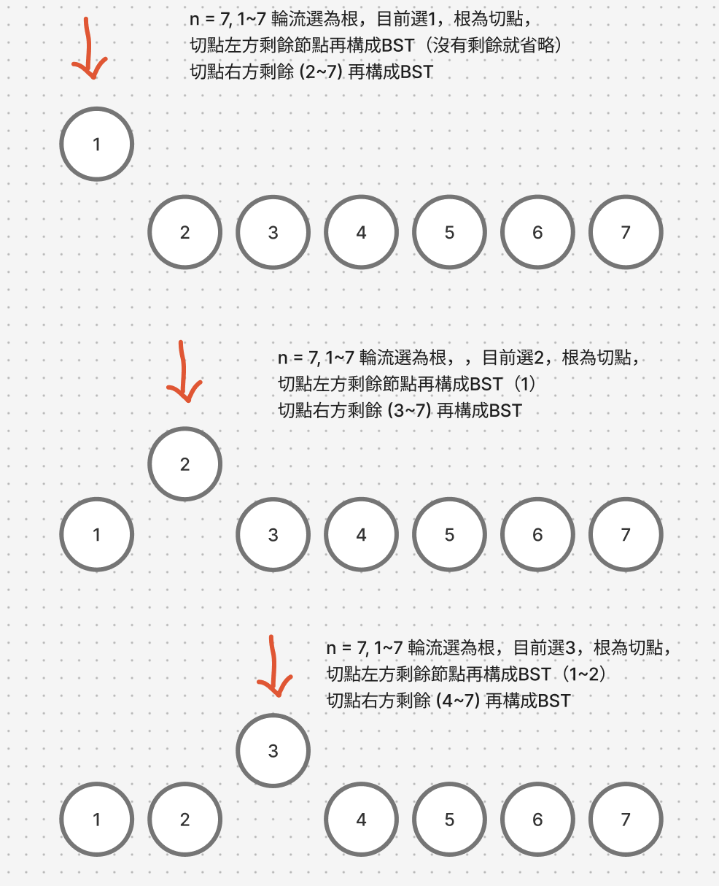

# 題目
https://leetcode.com/problems/unique-binary-search-trees/description/

# 開始分析
- 本題目背後的核心概念
  - 是否可以分解為子問題？是，因為我們只要考慮BST組成結構，節點的值是多少無所謂，只要知道切割前是連續數字，切割成子樹還是連續的數字。是同樣變因的子問題。
- 如何從問題推導出使用的解題工具
  - 利用動態回歸定義四步驟
  - 了解BST的特性
- 如何推導出最優複雜度
  - 時間複雜度：對於每個n，都有n-1種選根的方法 -> O(n^2)
  - 空間複雜度：對於1-n個節點，都存最佳解 -> O(n)

### 動態規劃
##### 如何解釋解題思路
其實觀察題目，可以得到很多線索，可以看到其中一個範例，所有數字輪流當根節點，並且將樹分成大於和小於的兩部分。


我們再稍微舉幾個例子就能有一個大概的策略，若有n個節點，則n個節點都能當根的。並且每一個節點當根，切成左右字子樹都能再用同樣的選根法算出結構數量。

以下範例跑一下就大概知道了。

可以看到若選了1，左邊剩0個，右邊就剩下6個。

若選了2，左邊剩1個，右邊就剩下5個。

若選了3，左邊剩2個，右邊就剩下4個。

...以此類推。是不是有點像遞迴的題目了？先把遞迴結構寫出來，如下
```js
function numTrees = function (n) {
    if (n <= 1) return 1
    let sum = 0
    for (let i = 1; i <= n; i++) {
        sum += numTrees(i - 1) * numTrees(n - i)
    }
    return sum
};
```
遞迴的思路就很好轉成動態規劃的子問題了，遞迴的輸入等於DP的索引，回傳值等於DP的儲存值。

再拿n=1~3舉例，可以發現n=3的左右子樹就是 n = 2, n = 1 的子問題答案


子問題已經確定，我們嘗試動態規劃四定義：
1. dp[i] = x, 定義為節點數為 i 時，所有結構數量的總和為 x
2. dp[i] = 對於j是1到i-1, 加總所有 (dp[i-j] * dp[j-1])
3. dp[0] = 1，0個節點只有一種結構
4. 遍歷順序是由小至大，因為大樹的結構總數是由小樹推演而來

##### 經分析後，本題詳細步驟如下：
1. 初始化DP陣列長度n+1，並設定基礎狀態，dp[1] = 0
2. i從1開始，利用for迴圈，對於所有根 1~i 都拿來當作根
3. 對於每個根，結構數量等於左子樹的結構數量總和，乘以右樹的結構數量總和
3. 由下至上，推演出最終 i = n 的結構數量，即為答案

時間複雜度：O(n^2)  
空間複雜度：O(n)

#### 程式碼
- Javascript
```js
var numTrees = function(n) {
    const dp = Array(n+1).fill(0)
    dp[0] = 1
    for (let i = 1; i <= n; i++) {
        for (j = 1; j <= i; j++) {
            dp[i] += (dp[i-j] * dp[j-1])
        }
    }
    return dp[n]
};
```
