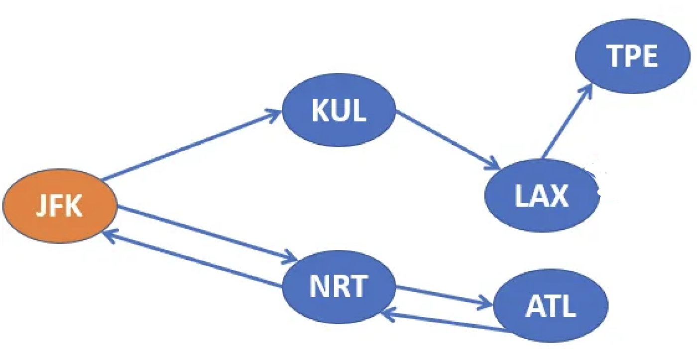
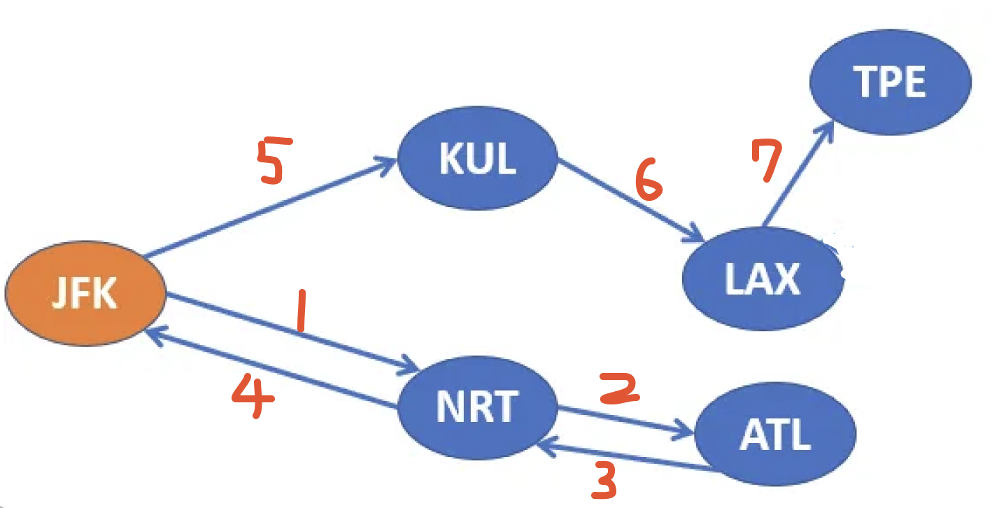
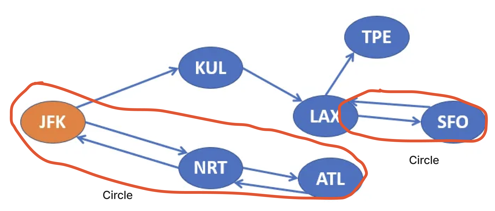
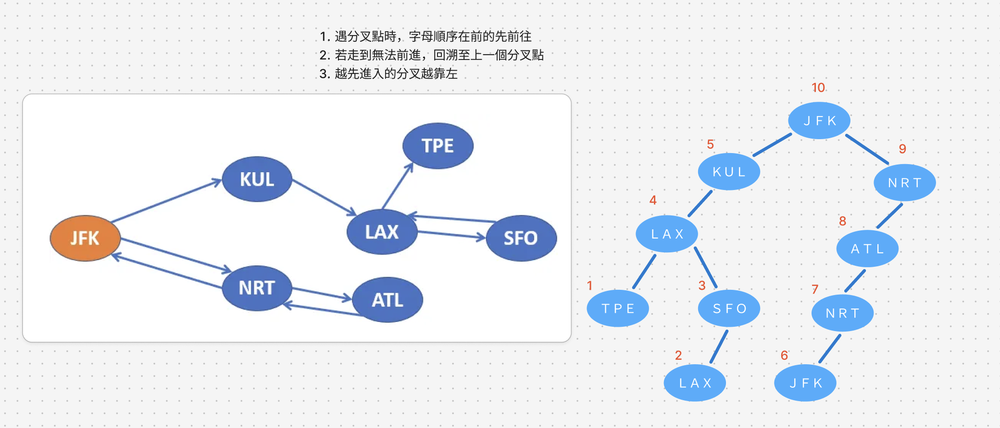
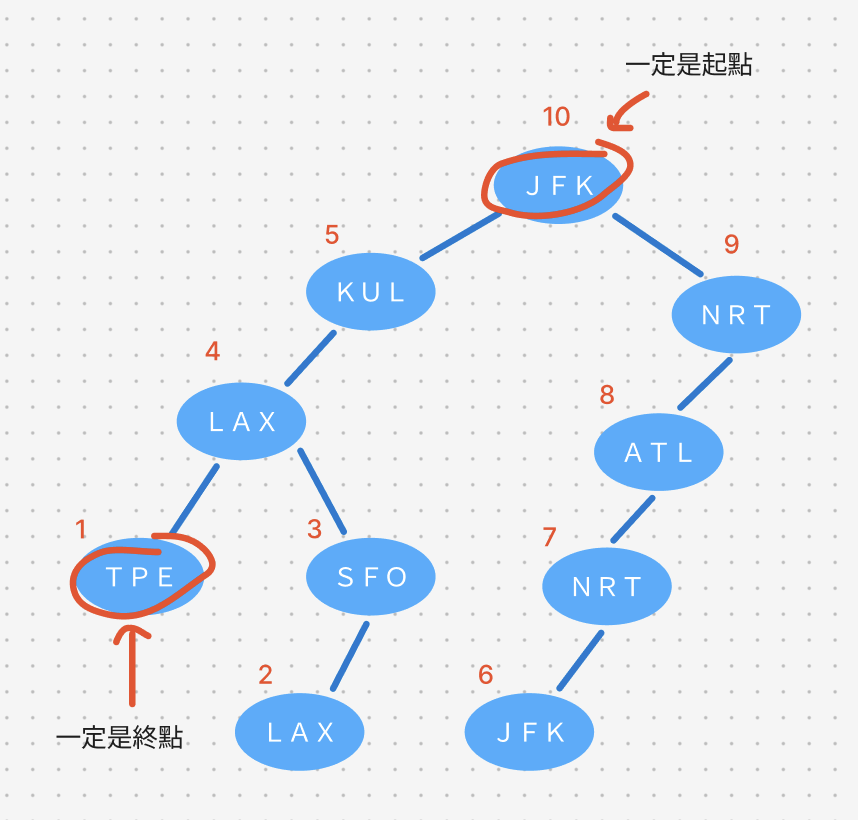

# 題目
https://leetcode.com/problems/reconstruct-itinerary/

# 開始分析
- 本題目背後的核心概念
  - 是否必要使用回溯法？否，僅需回傳一種解答
  - 圖形和樹的轉換技巧
- 如何從問題推導出使用的解題工具
  - 了解「一筆畫問題」、「歐拉路徑」的概念還有和後序遍歷的關係
- 如何推導出最優複雜度
  - 時間複雜度：使用所有機票一次 -> O(n)
  - 空間複雜度：紀錄經過的所有航站 -> O(n)

### 圖形 DFS

##### 如何解釋解題思路
本題需先透過觀察，得出三點結論
###### 一、即使失敗，仍需紀錄訪問過的路徑
傳統回溯法會嘗試所有的排列組合，以下圖為例，大體上來說一開始就必須選擇兩個方向之一。
1. JFK -> KUL
2. JFK -> NRT


首先依照字典順序(K小於N)，先選擇路徑1(往KUL)，但選擇路徑1會造成卡在TPE無法將剩下的機票（JFK > NRT > ATL > NRT > JFK）用完，所以回溯法會丟棄所有現在的嘗試，並選擇路徑2。

而選擇路徑2後會依照下列的遞迴順序，成功使用完所有7張機票

是不是已經發現回溯法慢的地方了？路徑2中第5,6,7個遞迴，不就是在走路徑1嗎？而在選擇路徑2之前，我們早就徹底走訪過路徑1了，所以本題若嘗試所有可能的排列組合，效率不是很高。時間複雜度為 O(n^n)， n 為邊的數量。
**重點**：因此即使失敗而產生回溯，仍不能丟棄訪問過的路徑！

##### 二、若任何一條路徑可以走到底且無法回頭，則該路徑必為最後選擇之路徑
以上圖為例，既然路徑1到達 TPE 後會卡死無法繼續往下走，那路徑 1 必定是最後的選擇，其他所有路徑必然先走。因此我們可以說，先走有環的路徑（若都有環，就照字母順序）

下圖再舉有多個環的例子，最優路徑為 JFK > NRT（因為有環）> ALT > NRT > NUL > LAX > SFO（因為有環）> LAX > TPE


##### 三、圖可以依一定規則轉換為樹狀
觀察以下特點，並且由於題目說一定可以走完所有航站，代表可以轉換任意圖為樹：
1. 圖的路徑分叉可以看做樹的分叉
2. 雙向路徑可以攤平成單向，例如 A <-> B 可以看成 A > B > A
3. 字母順序在前的靠左（要先遍歷）

依照規則轉圜樹如下


最後，來利用以上三點結論
1. 首先將範例轉成樹，如下圖
2. 我們嘗試一次，不停往下一站走直到走到底。則該底部一定是在我們最後選擇的路徑，也是我們整個旅程的終點。（請見上方結論二）
3. 起點和終點確定了，我們觀察下圖，從終點出發的順序1~10完全等於「後序遍歷」的順序，因此我們只要後序遍歷完後反過來，就是起點到終點


本題還有另外一個重點：如何排序才能優先找出字母小的組合？對機票以目的地做升序排序，產生的邊向量表就是升序的，遍歷會依照字母順序遍歷。


##### 經分析後，本題詳細步驟如下：
1. 先將機票依照字母排序
2. 建立邊的向量表
3. 以後序遍歷依序輸出節點（記得走過的邊要從向量表刪除）
4. 反轉順序作為答案輸出

時間複雜度：邊長數量為E（等於機票數量） -> O(E)  
空間複雜度：儲存用完機票後經過的路徑 -> O(E)

#### 程式碼
- Javascript
```js
/**
 * @param {string[][]} tickets
 * @return {string[]}
 */
function findItinerary(tickets) {
    tickets.sort();
    const edges = tickets.reduce((acc, cur) => {
        const [from, to] = cur
        if (!acc[from]) acc[from] = []
        acc[from].push(to)
        return acc
    }, {})
    const ans = []
    const dfs = (curStop) => {
        const nextStops = edges[curStop]
        while (nextStops?.length > 0) {
            dfs(nextStops.shift())
        }
        ans.push(curStop)
    }
    dfs('JFK')
    return ans.reverse()
}
```
