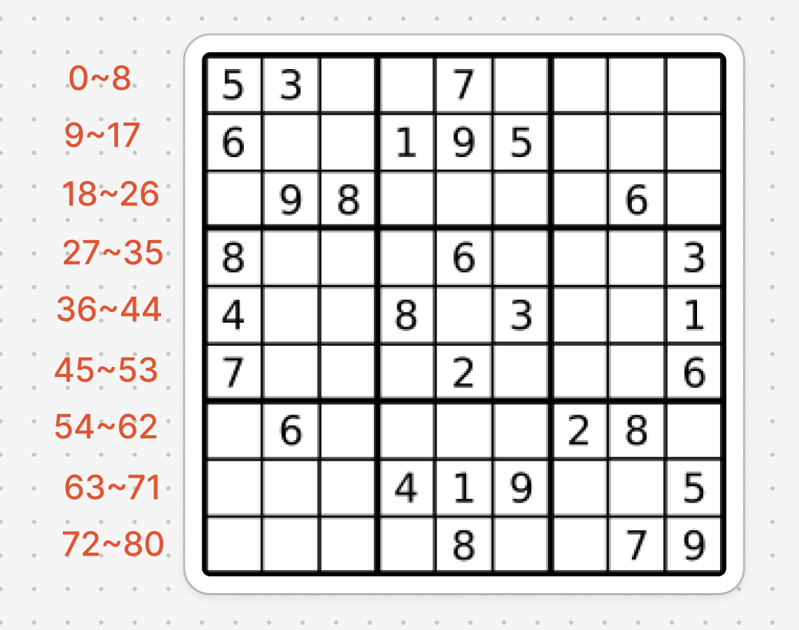

# 題目
https://leetcode.com/problems/sudoku-solver/description/

# 開始分析
- 本題目背後的核心概念
- 如何從問題推導出使用的解題工具
  - 回溯模板
- 如何推導出最優複雜度
  - 時間複雜度：固定嘗試 81 * 9 種組合 -> O(1)
  - 空間複雜度：不需額外空間 -> O(1)

### 回溯法

##### 如何解釋解題思路
本題為進階回溯法，但只是在模板之上加上了比較複雜的座標轉換和有效性驗證。

乍看之下，和 N-Queen 有點像，決策樹的橫軸是單行的每個格子，縱軸是每一行。
但實際上橫軸是 1~9 數字，9x9的棋盤需要扁平化成81格，決策樹深度就是81，如下圖。

稍微修改回溯模板，邏輯輪廓就出來了：
```js
const backtrack = (start) => {
    if (start >= 81) {
        return true
    }
    const [row, col] = getPosition(start) // ex. 翻譯第80格，翻成第9行第9列
    for (let n = 1; n < 10; n++) {
        const nStr = String(n)
        if (isValid(row, col, nStr)) {
            board[row][col] = nStr
            if (backtrack(start + 1)) {
                return true
            }
            board[row][col] = '.'
        }
    }
    return false
}
```
要注意當我們判斷到達結束條件時，我們不是將答案放入結果集，而是直接回傳 true 終止接下來任何操作，因為我們只要找到一組答案即可。
而在放入任何數字前，必須確保該格可以放入該數字，因此以`isValid` 驗證要判斷當放下數字 nStr 時，確保垂直線、水平線、區塊內沒有相同數字。

```js
const isValid = (row, col, nStr) => {
  // 檢查水平線
  for (let i = 0; i < 9; i++) {
      if (board[row][i] === nStr) return false
  }
  // 檢查垂直線
  for (let i = 0; i < 9; i++) {
      if (board[i][col] === nStr) return false
  }
  // 檢查區塊
  const rowStart = row - (row % 3)
  const colStart = col - (col % 3)
  for (let i = rowStart; i < rowStart + 3; i++) {
      for (let j = colStart; j < colStart + 3; j++) {
          if (board[i][j] === nStr) return false
      }
  }
  return true
}
```
當目前格子已經有數字時，前往下一格子：
```js
if (board[row][col] !== '.') {
    if (backtrack(start + 1)) {
        return true
    }
}
```
再加上翻譯座標的邏輯：
```js
const getPosition = (pos) => {
    const row = Math.floor(pos / 9)
    const col = pos % 9
    return [row, col]
}
```
即構成最終程式碼。

##### 經分析後，本題詳細步驟如下：
總共 81 格需填空，依據座標順序遞迴填空
1. 若已填數字，則移動往下一格
2. 若未填，依順序嘗試1~9，確認垂直線、水平線、區塊內沒有相同數字後填入
3. 若皆無法填入，嘗試失敗，回溯
4. 81格成功填完則終止遞迴


時間複雜度：O(1)  
空間複雜度：O(1)

#### 程式碼
- Javascript
```js
/**
 * @param {character[][]} board
 * @return {void} Do not return anything, modify board in-place instead.
 */
var solveSudoku = function (board) {
    const getPosition = (pos) => {
        const row = Math.floor(pos / 9)
        const col = pos % 9
        return [row, col]
    }
    const isValid = (row, col, nStr) => {
        const rowStart = row - (row % 3)
        const colStart = col - (col % 3)
        for (let i = 0; i < 9; i++) { // 合併三個迴圈為一個
            // check horizontal
            if (board[row][i] === nStr) return false
            // check vertical
            if (board[i][col] === nStr) return false
            // check block
            if (board[rowStart + Math.floor(i / 3)][colStart + i % 3] === nStr) return false
        }
        return true
    }
    const backtrack = (start) => {
        if (start >= 81) {
            return true
        }
        const [row, col] = getPosition(start)
        if (board[row][col] !== '.') {
            if (backtrack(start + 1)) {
                return true
            }
        } else {
            for (let n = 1; n < 10; n++) {
                const nStr = String(n)
                if (isValid(row, col, nStr)) {
                    board[row][col] = nStr
                    if (backtrack(start + 1)) {
                        return true
                    }
                    board[row][col] = '.'
                }
            }
        }
        return false
    }
    backtrack(0)
};
```
