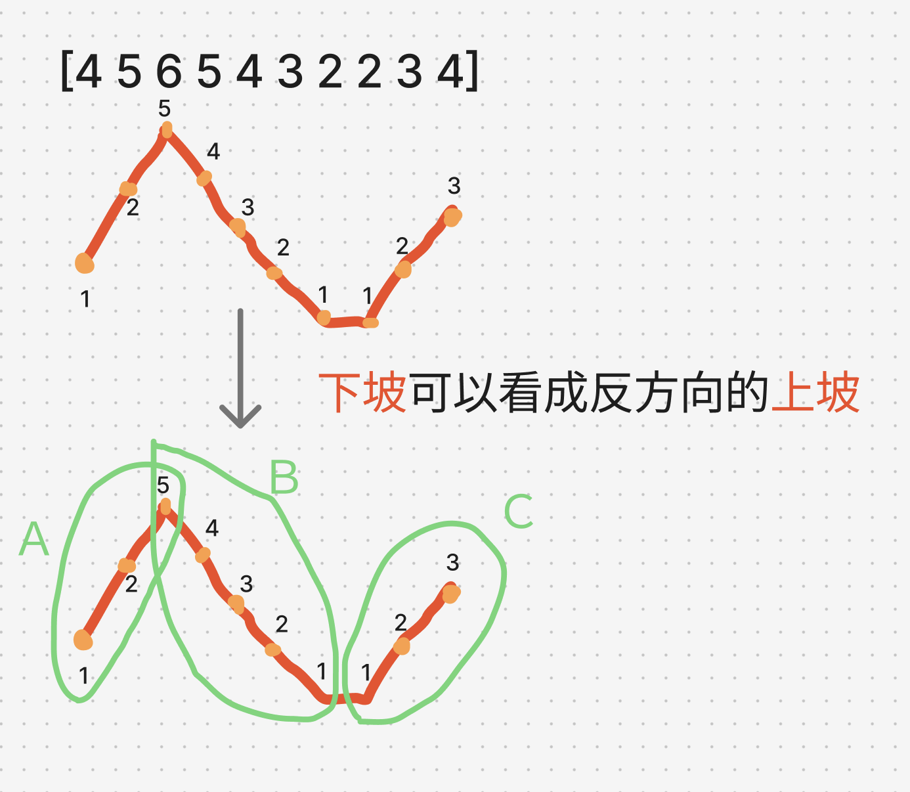
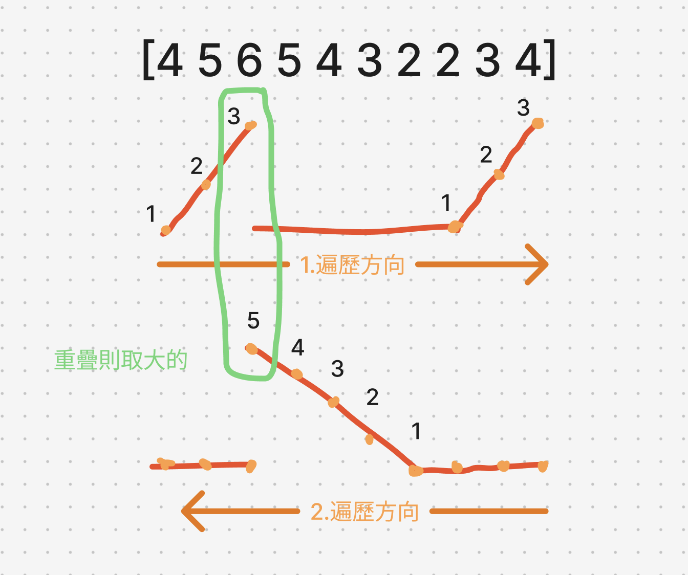

# 題目
https://leetcode.com/problems/candy/description/

# 開始分析
- 本題目背後的核心概念
  - 本題是否用貪婪法？若有觀察到波型能切割成「左方上坡」和「右方上坡」，那滿足貪婪的子問題切割條件
  - 局部最優解：前一個小孩的糖果數+1（但要遍歷兩個頭尾方向）
- 如何從問題推導出使用的解題工具
  - 波型題、峰值題如何處理平地？
- 如何推導出最優複雜度
  - 時間複雜度：遍歷兩次 -> O(n)
  - 空間複雜度：一個陣列存糖果數 -> O(n)

### 貪婪法

##### 如何解釋解題思路

這題在分解局部最優解的時候會發現沒辦法只考慮左方的小孩ratings多少，同時也必需考慮右方的小孩有多少。
如下圖，給定分給每個小孩的糖果數量的陣列：candies = [1,2,5,...]，給第三個小孩的5個糖果，是取決於右方的小孩拿了4個。也就是取決於比較長的上坡在左方還是右方。

這題是波型圖，透過觀察下圖，發現可以把除了平地以外的所有部分都看成上坡，這樣問題就可以分解成兩個貪婪。




既然只是方向不同的上坡，那我們就兩個不同方向各遍歷一次，並在遍歷途中計算坡度。

至於平地，依照規則，糖果數維持都是1就好。也就是只要同個方向持續是上坡我們就一直累加糖果數，除此之外的小孩糖果都給1。

遍歷完兩個方向，重疊的部分取比較大的值即可，如下圖。



因此，這題的「局部最優解」定義就是：給了前一個孩子N個糖果，而只要當前孩子比前一個孩子胃口 (ratings[i]) 大，那就給N+1個糖果。
並且進行雙方向的貪婪法後取最大值。

##### 經分析後，本題詳細步驟如下：
1. 維護一個 candies 陣列紀錄每個孩子拿多少糖果，預設每位1個
2. 由左至右遍歷，若前一個 ratings 小於目前ratings[i]，多給一個糖果
3. 相反方向遍歷一次用同樣邏輯，candies[i] 取兩次的最大值
4. 加總 candies 並回傳答案


時間複雜度：  
空間複雜度：

#### 程式碼
- Javascript
```js
/**
 * @param {number[]} ratings
 * @return {number}
 */
var candy = function (ratings) {
    const candies = Array(ratings.length).fill(1)
    for (let i = ratings.length - 2; i >= 0; i--) { // i = 0 不用遍歷因為由左開始的話永遠是 1
        if (ratings[i] > ratings[i+1]) candies[i] = candies[i+1] + 1
    }
    for (let i = 1; i < ratings.length; i++) { // last i 不用遍歷因為由又開始的話永遠是 1
        if (ratings[i] > ratings[i-1]) candies[i] = Math.max(candies[i-1] + 1, candies[i])
    }

    return candies.reduce((acc, cur) => acc + cur)
};
```
