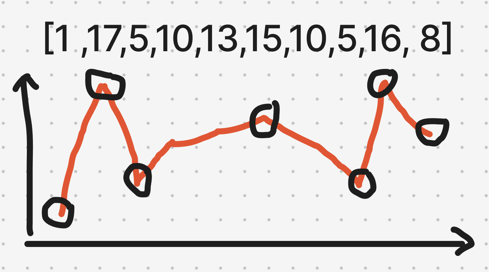

# 題目

https://leetcode.com/problems/wiggle-subsequence/description/

# 開始分析

- 本題目背後的核心概念
  - 陣列中需要和相鄰元素比較大小的常見題「波型題」，這次要找的是「峰值」。
  - 如何處理平地（相鄰元素相等）的情況
- 如何從問題推導出使用的解題工具
  - 陣列是數字且忽大忽小、不可排序，可推測與峰值或波型有關。
  - **背**：子序列的定義，為原本字串刪除任意字元後組成。
- 如何推導出最優複雜度
  - 必須遍歷所有字元，且遍歷完後可以知道答案 -> O(n)

### DP

1. 本題目背後的核心概念
    - 是否需要分解為子問題？可以，任一位置的最長子序列，取決於前個位置的狀態（往上還是往下）還有前個位置的最長子序列。
2. 如何從問題推導出使用的解題工具
    - DP 需要定義子問題的變量和值，再定義遍歷順序。
3. 如何推導出最優複雜度
    - 必須遍歷所有元素，且遍歷完後可以知道答案：O(n)
    - 需要兩個陣列紀錄各 index 的最長擺動子序列：O(2n) = O(n)

- 定義子問題：
  - 目前上行中，到目前的 index 為止，最長擺動子序列的元素數量為 x
  - 目前下行中，到目前的 index 為止，最長擺動子序列的元素數量為 x
  - 變量為(1) 目前的上下行狀態，(2) index。值為最長擺動子序列的元素數量
##### 如何解釋解題思路
陣列任一位置，其最長擺動子序列長度可以前面的擺動狀態和序列長度計算得來：
1. 若目前數字大於前一數字，代表上行中
- 狀態為下行的目前位置之值，新值為上行狀態前一位置的值＋１
- 狀態為上行的目前位置之值，繼承前一位置值
2. 反之，若目前數字小於前一數字，代表下行中
- 狀態為上行的目前位置之值，新值為下行狀態前一位置的值＋１
- 狀態為下行的目前位置之值，繼承前一位置值

##### 經分析後，本題詳細步驟如下：


#### 程式碼

```js
const PREV_STATE = {
  UP: 0,
  DOWN: 1
};
/**
 * @param {number[]} nums
 * @return {number}
 */
var wiggleMaxLength = function (nums) {
  const dp = Array(nums.length).fill().map(() => Array(2));
  dp[0][PREV_STATE.UP] = dp[0][PREV_STATE.DOWN] = 1;
  for (let i = 1; i < nums.length; i++) {
    dp[i][PREV_STATE.UP] = dp[i - 1][PREV_STATE.UP];
    dp[i][PREV_STATE.DOWN] = dp[i - 1][PREV_STATE.DOWN];
    if (nums[i - 1] > nums[i]) dp[i][PREV_STATE.DOWN] = dp[i - 1][PREV_STATE.UP] + 1;
    if (nums[i - 1] < nums[i]) dp[i][PREV_STATE.UP] = dp[i - 1][PREV_STATE.DOWN] + 1;
  }
  return Math.max(dp.at(-1)[PREV_STATE.UP], dp.at(-1)[PREV_STATE.DOWN]);
};
```

### 找峰值

以 Example2 的資料為例，`[1,17,5,10,13,15,10,5,16,8]`可以看到我們要的其實就是山峰和山谷的數量


##### 經分析後，本題詳細步驟如下：

1. 除去所有平地（nums[n] === nums[n+1]）
2. 遍歷所有點，對所有點判端是否是山峰或山谷，若是則計數加一
    - 頭和尾都算山峰山谷
3. 回傳總計數即為答案

時間複雜度：需要遍歷所有點 -> O(n)  
空間複雜度：只有需要一個 counter 儲存峰谷數 -> O(1)

#### 程式碼

- Javascript

```js
/**
 * @param {number[]} nums
 * @return {number}
 */
var wiggleMaxLength = function (nums) {
  nums = nums.filter((v, i) => i === 0 || v !== nums[i - 1]);
  if (nums.length < 2) return nums.length;
  const isPeakOrValley = (cur) => {
    if (nums[cur] > nums[cur - 1] && nums[cur] > nums[cur + 1]) return true;
    if (nums[cur] < nums[cur - 1] && nums[cur] < nums[cur + 1]) return true;
    return false;
  };
  let count = 2;
  for (let i = 1; i < nums.length - 1; i++) {
    if (isPeakOrValley(i)) {
      count++;
    }
  }
  return count;
};
```
