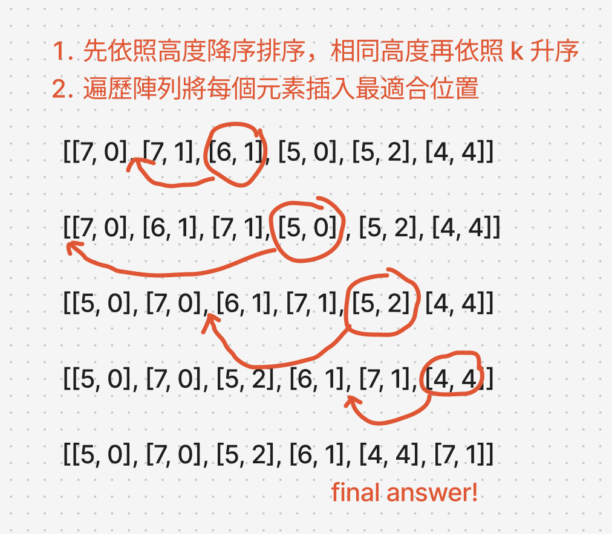
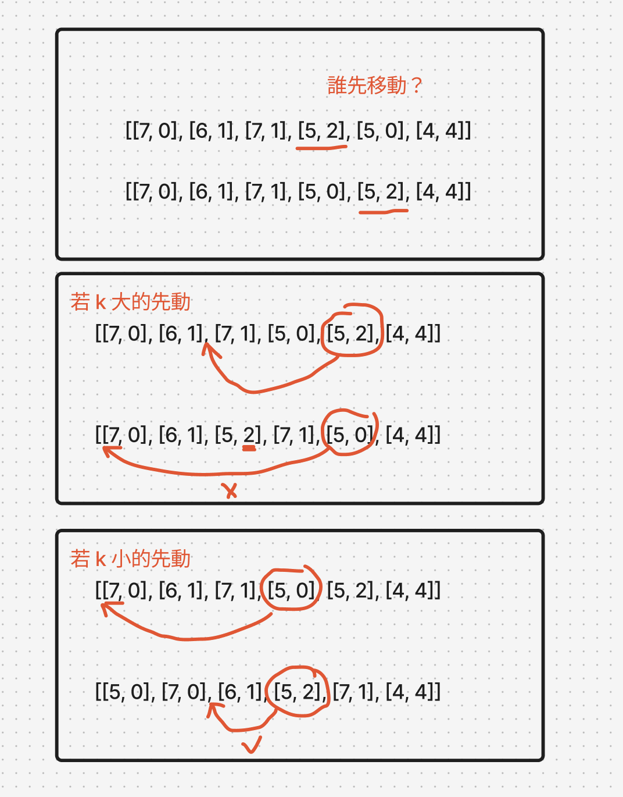

# 題目

https://leetcode.com/problems/queue-reconstruction-by-height/description/

# 開始分析

- 本題目背後的核心概念
  - 本題是否用貪婪法？是，透過觀察確定「局部最優解」為：依高度降序依據k將元素插入最適合位置。
- 如何從問題推導出使用的解題工具
  - 雙條件陣列可以透過排序某一條件，嘗試先確定下一個變因，再解決另一個。
  - 因為沒有模板，貪婪法可以花費十分鐘左右觀察。
- 如何推導出最優複雜度
  - 時間複雜度：排序 O(nlogn)、遍歷加上插入正確位置O(n^2) -> O(n^2)
  - 空間複雜度：可以修改原有陣列而不需額外空 -> O(1)

### 貪婪法
##### 如何解釋解題思路

以第一個測資為例，people = `[[7,0],[4,4],[7,1],[5,0],[6,1],[5,2]]`，開始觀察。
雙條件必須先把一個條件確立下來，先嘗試依高度或 k 做升序/降序，觀察是否能定義出局部最優解。

觀察個十來分鐘後，發現依照高度做降序排序：`[[7,0],[7,1],[6,1],[5,0],[5,2],[4,4]]`有下列特性：
- 在任意位置 i，前面的都比較高，而比 people[i] 矮的就算插入任意數量都不會影響到我的 k 約束，以 people[1] `[7,1]` 為例，不論`[[6,1],[5,0],[5,2],[4,4]]`何者插入 `[7,0],[7,1]`之間，都不使`[7,1]`違反其約束 k=1



發現了特性，我們就可以由高到矮依序將 people[i] 插入「正確的位置」，後面不管再插入任何值都不影響其約束。

但有一點要注意，若高度相等，插入的順序是k小的先還是k大的？
如下圖，會發現：
- 如果k比較小，必須先插入，否則先插入大k才往左插k比較小的，會破壞大k的元素的約束。



因此排序是先依照高度降序，再依照k升序。

然後依順序遍歷並將 people[i] 插入對應位置即可。

##### 經分析後，本題詳細步驟如下：
1. 將people先依照高度降序，再依照k升序。
2. 遍歷 people, 將people[i] 插入其 index k 的位置
3. 遍歷完成，回傳答案陣列

時間複雜度：O(n^2)  
空間複雜度：O(1)

#### 程式碼

- Javascript

```js
var reconstructQueue = function (people) {
    people.sort(([h1, k1], [h2, k2]) => h1 === h2 ? k1 - k2 : h2 - h1)
    for (let i = 0; i < people.length; i++) {
        const k = people[i][1]
        const removed = people.splice(i, 1)[0]
        people.splice(k, 0, removed)
    }
    return people
};
```
