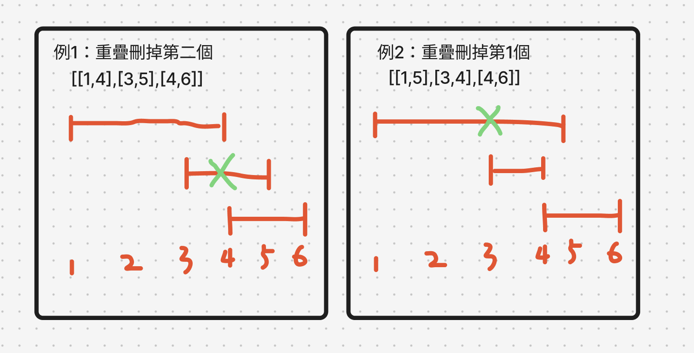

# 題目
https://leetcode.com/problems/non-overlapping-intervals/description/

# 開始分析
- 本題目背後的核心概念
  - 本題是否用貪婪法？是，透過觀察確定「局部最優解」為：依start升序，並在重疊發生時選擇結束較晚的區間刪除。
- 如何從問題推導出使用的解題工具
  - 雙條件陣列可以透過排序某一條件，嘗試先確定下一個變因，再解決另一個。
  - 因為沒有模板，貪婪法可以花費十分鐘左右觀察。
- 如何推導出最優複雜度
  - 時間複雜度：排序需要O(nlogn)、遍歷需要O(n) -> O(nlogn)
  - 空間複雜度：進需要紀錄 lastEnd -> O(1)

### 貪婪法

##### 如何解釋解題思路

遇到變動的雙條件先想辦法確定其中之一，所以嘗試對 start, end排序（其實對哪個排序都一樣， end只是順序反過來看的start而已）

這邊先嘗試升序排序start，然後既然是貪婪法，我們先觀察個十分鐘。
如下圖，透過觀察，知道既然start照順序的，所以當重疊選擇要刪哪一個區間，只要透過本區間的end和下一個區間的start比對，若下個區間在本區間結束之前就開始了，那就是有重疊。

當有重疊的時候，我們刪除end大的，因為我們要選擇局部最優（end越大的越容易造成區間重疊）

確定局部最優解後我們遍歷所有區間並依據局部最優解，當有重疊發生時刪除end大的區間

##### 經分析後，本題詳細步驟如下：
1. 升序排序intervals
2. 遍歷intervals，維護lastEnd變數紀錄上一個區間的End，當intervals[i]的start小於lastEnd，重疊發生
3. 重疊發生時，計數加一，並記錄較小的end做為lastEnd
4. 遍歷完畢，回傳計數即為答案

時間複雜度：O(nlogn)  
空間複雜度：O(1)

#### 程式碼
- Javascript
```js
/**
 * @param {number[][]} intervals
 * @return {number}
 */
var eraseOverlapIntervals = function(intervals) {
    intervals.sort((a,b) => a[0] - b[0])
    let removal = 0, lastEnd = intervals[0][1]
    for (let i = 1; i < intervals.length; i++) {
        const [start, end] = intervals[i]
        if (start < lastEnd) {
            removal++
            lastEnd = Math.min(lastEnd, end)
        } else {
            lastEnd = end
        }
    }
    return removal
};
```
