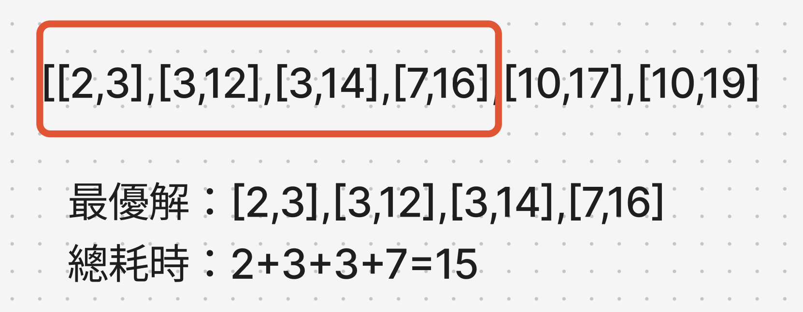
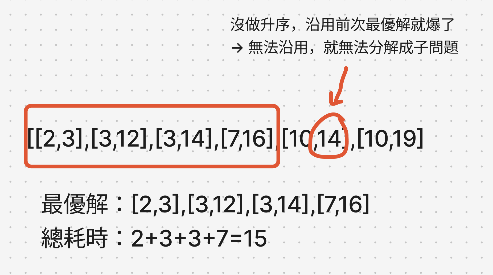

# 題目
https://leetcode.com/problems/course-schedule-iii/description/

# 開始分析
- 本題目背後的核心概念
  - 整體可否拆解/切割出子問題？
    - 可以，先依**結束日期**升序排序後，得以維護一個對於前K個課程，在結束日期（`course[k][1]`）內，能上最多課程的**最優解**
  - 可否使用 Greedy？
    - 排序前，拿取條件為所需天數最小：不行，因為有可能該課程無時限。
    - 排序前，拿取條件設為最快到期：不行，有可能該課程很耗時。
    - 排序後，可否使用 Greedy？**可以**
      - 貪婪優化：每次都用目前課程，在前次最優解之上，做出最佳決策 
        - 嘗試放目前課程進去，如果失敗，拿出已放入但最耗時的課程再試一次（嘗試優化），如果還是失敗，則略過目前課程。
- 如何從問題推導出使用的解題工具
  - 排序，達成問題可分割性
  - 貪婪優化
- 如何推導出最優複雜度
  - 時間複雜度：若要達到子問題的可分割性（排序），則至少必須要 nlogn
  - 空間：需要 O(n) 的空間記憶子問題的最優解

## 如何解釋解題思路
### 貪婪優化

處理到第K個課程時，總是維護一個用前K個課程建構出的最優解。若我們用結束時間做升序排序，則我們可以將前一個課程算出的最優解，當作目前課程的基礎，算出當前的最優解，有點像是將題目分解成子問題，並用 DP 慢慢迭代最優解。

舉例來說，當 K=4 時，最優解為

因此在計算 K=5 時，由於升序排列，我們知道K=4之最優解的所有課程總耗時一定**小於等於17**（第5個課程為`[10, 17]`），因此永遠不會怕前面的最優解會在K=5超時，造成無法沿用。
既然能沿用，以下策略就可行：
1. 嘗試往前次最優解多塞一個目前課程進去，塞不進去就沿用，確保數量只增不減
2. 塞不進去時，嘗試優化「**前次最優解**」（數量一樣但總耗時更短）

舉個無法沿用的反例，若沒排序，第5個課程結束日期提前至14



分析完畢後，我們知道先對課程依照**結束日期**做升序排序後，符合貪婪算法的條件，並且可以在線性時間取得最佳解。

排序後，遍歷所有課程，每次遍歷：
- 若耗時允許，將目前課程直接放入**已選課程列表**（前次最優解）
- 若上了目前課程後會超過**目前結束日期**，嘗試用目前課程優化**已選課程列表**或略過目前課程
  - 優化：如果已選課程中耗時最長的耗時，比目前課程耗時長，將兩者替換總是可優化已選課程列表（滿足結束日期，且有更低的總耗時數）
    - 用 MaxHeap 可以快速取出耗時最長的課程

完成遍歷後，**已選課程列表**即為最優解，直接回傳其長度即可。


時間複雜度：sort cost **nlogn**, heap operation cost **n** -> total **O(nlogn)**
空間複雜度：heap n -> O(n)

### 程式碼
- Javascript
- 引用常用資料結構 MaxHeap：[heap.js](/key-algorithms/heap.js)
```js
/**
 * @param {number[][]} courses
 * @return {number}
 */
var scheduleCourse = function (courses) {
  courses.sort((a, b) => {
      const [, lastDayA] = a
      const [, lastDayB] = b
      return lastDayA - lastDayB
  })

  const maxHeap = new Heap((parent, child) => parent >= child)
  let curTime = 0, count = 0
  

  for (const [duration, lastDay] of courses) {
      curTime += duration
      maxHeap.insert(duration)
      if (curTime > lastDay) curTime -= maxHeap.pop()
  }

  return maxHeap.size()
};
```
