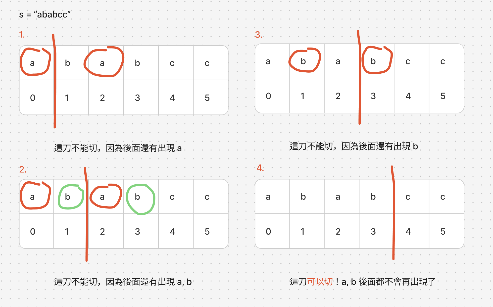
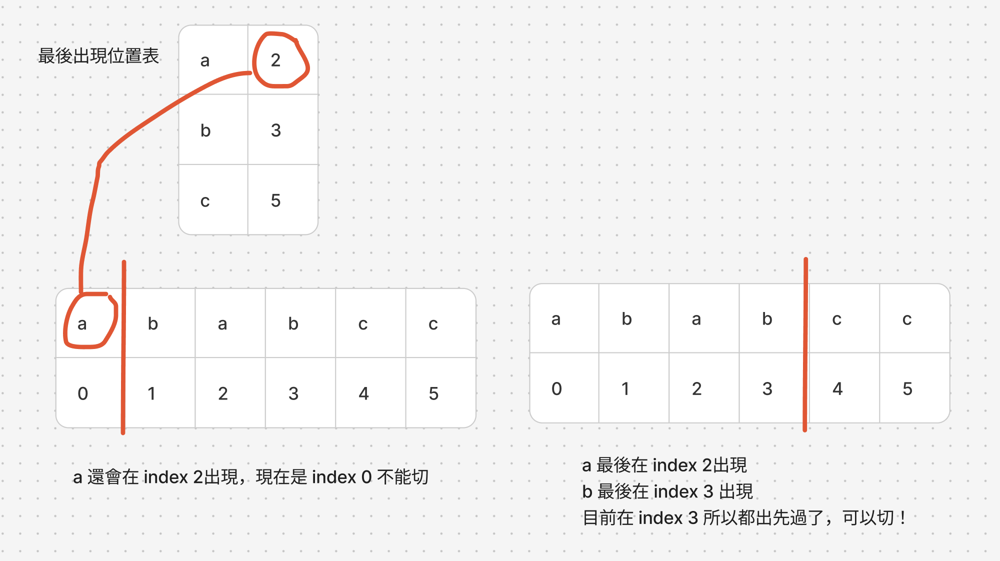

# 題目
https://leetcode.com/problems/partition-labels/description/

# 開始分析
- 本題目背後的核心概念
  - 遇到雙條件，可以先記錄條件一的結果，再對不同的條件二求結果。
- 如何從問題推導出使用的解題工具
  - 陣列任一位置的結果，若同時受制於左方與右方，可以通過正向、反向，兩次遍歷決定結果。
- 如何推導出最優複雜度
  - 時間複雜度：遍歷兩次各為 O(n) -> O(n)
  - 空間複雜度：僅需常數額外空間 -> O(1)

### 貪婪法

##### 如何解釋解題思路
這題可以看成尋找切點，如何用n切點將字串分成n+1個。
暴力法是從頭選擇每個字元作為切點(切在i, i+1之間)，對於每一個切點，用迴圈確認切點之前的所有字元不會出現在切點之後。
複雜度為：遍歷n x 確認 n = O(n^2)

要追求更有效率的方法，我們已知要確認切可不可行，需要「往前」和往後看，這是典型的先固定一個條件的問題。

如下圖，可以發現，決定要不切的因素同時受制於切點「往前」的所有元素在切點「往後」的出現與否。

我們可以從後方開始遍歷，先創建出個字元的「最後出現位置表」將需要的資訊儲存下來。有了最後出現位置，我們在順向遍歷的時候就可以判斷左邊的字元還有沒有可能再右邊出現。若沒有，就可以切了

我們可以維護一個「最早可分割位置」的變數，每次遍歷到新字元，都會更新「最早可分割位置」到該字元最後出現的位置，因為可以確定的是，在那個「最早可分割位置」之前都不可以切割，若切割則左右都會出現會將該字元。

##### 經分析後，本題詳細步驟如下：
1. 從後方反向遍歷，紀錄所有字元最後出現的位置
2. 順向遍歷，每次遍歷用目前字元查表，更新「最早可分割位置」為該字元最後出現位置
3. 遍歷時持續計數該次分割的字元數
4. 若已遍歷到「最早可分割位置」，則可以進行切割，切割完將計數放進答案，並將計數歸零


時間複雜度：O(n)  
空間複雜度：O(1)

#### 程式碼
- Javascript
```js
var partitionLabels = function (s) {
    const lastIndexMap = {}
    const ans = []
    let lastIndex = -1, count = 0
    for (let i = s.length - 1; i >= 0; i--) {
        if (!lastIndexMap[s[i]]) lastIndexMap[s[i]] = i // track first occurrence from tail
    }
    for (let i = 0; i < s.length; i++) {
        count++
        const charLast = lastIndexMap[s[i]]
        lastIndex = Math.max(lastIndex, charLast)
        if (lastIndex === i) {
            ans.push(count)
            count = 0
        }
    }
    return ans
};
```
