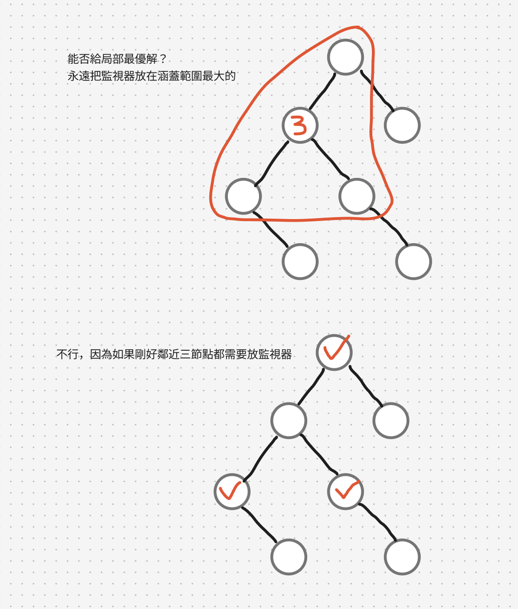
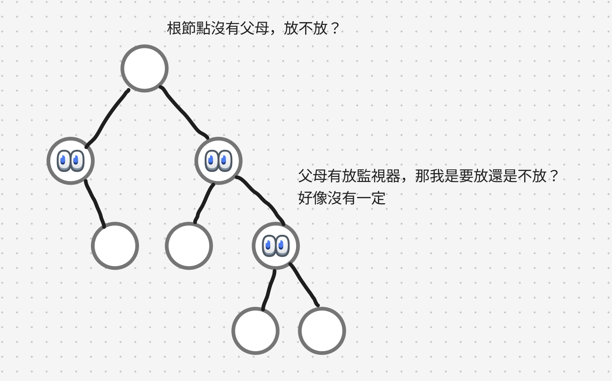
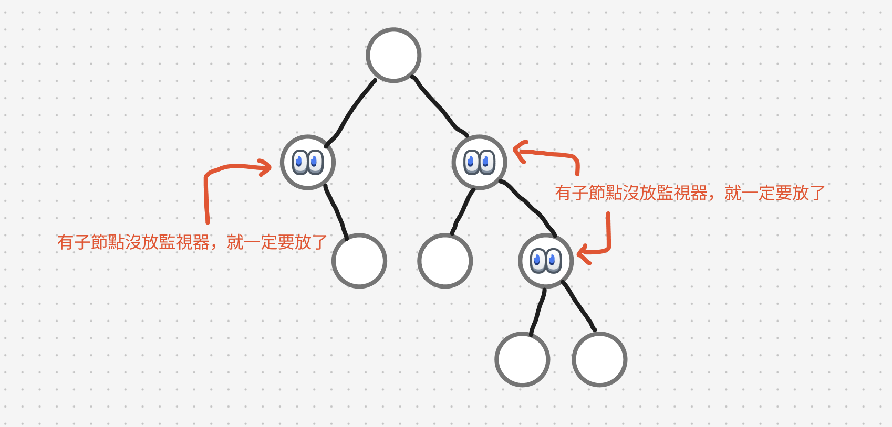
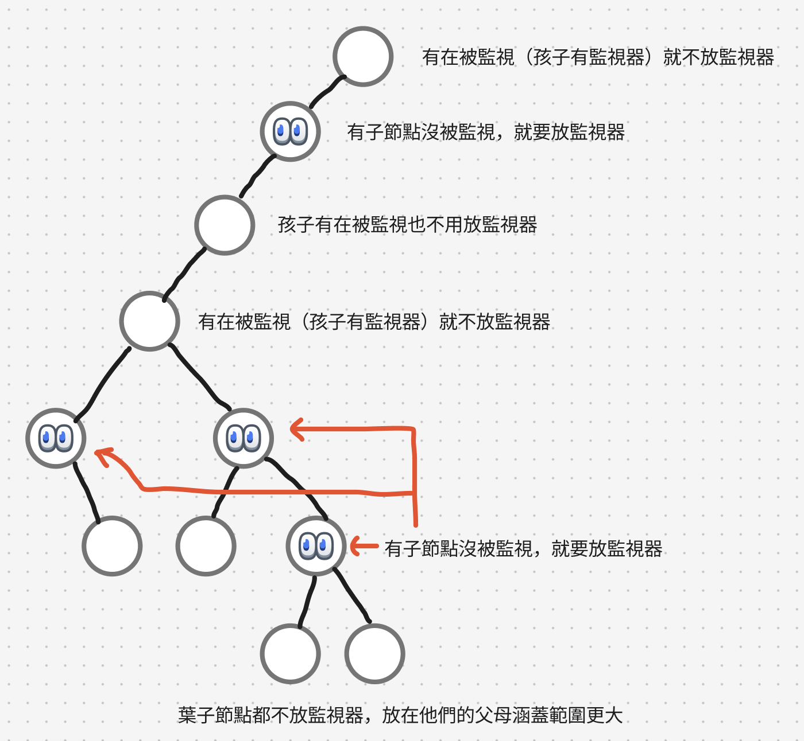

# 題目
https://leetcode.com/problems/binary-tree-cameras/description/

# 開始分析
- 本題目背後的核心概念
  - 用何種順序遍歷？後序遍歷，因為父母的狀態能由孩子的狀態決定
- 如何從問題推導出使用的解題工具
  - 當變因不只一種時，可嘗試狀態轉移
- 如何推導出最優複雜度
  - 時間複雜度：遍歷所有節點 -> O(n)
  - 空間複雜度：不需額外空間 -> O(1)

### DFS

##### 如何解釋解題思路
一開始先嘗試，能否用貪婪的方法，給涵蓋範圍最大的節點（放一個監視器可以監視三個節點）都先放上監視器。但後來發現其實涵蓋範圍最大的點不一定會放監視器。



放不放監視器是怎麼決定的？是由上往下，父母的狀態能夠使孩子決定要不要放監視器呢。
還是由下往上，孩子的狀態能決定父母放不放監視器。結論是後者。

因為如果想由父母狀態決定孩子會遇到兩個問題：
1. 根節點沒有父母，放不放監視器？
2. 父母有放監視器，那我是要放還是不放？好像沒有一定，要繼續往下看樹結構


反之由下往上可以很單純的決定：


最基本的，有孩子沒放，那就一定要放監視器了，不然再往上就沒機會監視這個孩子。而孩子沒有放監視器，父母也不是沒事，也要再往上傳遞已經被監視的狀態。

經過一通整理，孩子總共有三種狀態可以決定父母的狀態
1. 沒被監視
2. 本身有監視器
3. 正在被監視（但沒有監視器）



依據孩子狀態決定父母狀態，是典型的後序遍歷，我們嘗試用遞迴三定義去定義DFS
1. 定義輸入輸出：傳入根節點，回傳根節點的狀態
2. 定義終止條件：根為空
3. 定義具體邏輯：
  - 若任一孩子沒被監視，則在目前節點架設監視器，計數器加一
  - 若任一孩子已經架設監視期，則目前節點狀態為「被監視中」
  - 若目前節點為空，也回傳「被監視中」，因其同義於「不需額外被監視」

##### 經分析後，本題詳細步驟如下：
1. 先維護一個監視器的計數，並事先定義節點的三種監視狀態。
2. 從根開始DFS，遞迴左右孩子並取得其監視狀態
3. 若任一孩子沒被監視，則在目前節點架設監視器，計數器加一
4. 若任一孩子已經架設監視期，則目前節點狀態為「被監視中」
5. 若目前節點為空，也回傳「被監視中」，因其同義於「不需額外被監視」
6. 以上狀態以外，都回傳「沒被監視」
7. 遞迴結束，回傳計數器為答案。

時間複雜度：O(n)  
空間複雜度：O(1)

#### 程式碼
- Javascript
```js
const State = {
    UNMONITORED: 1,
    HAS_MONITOR: 2,
    BE_MONITORED: 3,
}
/**
 * @param {TreeNode} root
 * @return {number}
 */
var minCameraCover = function (root) {
    let count = 0
    const dfs = (node) => {
        if (!node) return State.BE_MONITORED // 意即不需要再被監視
        const leftState = dfs(node.left)
        const rightState = dfs(node.right)
        if ([leftState, rightState].includes(State.UNMONITORED)) {
            count++
            return State.HAS_MONITOR
        }
        if ([leftState, rightState].includes(State.HAS_MONITOR)) {
            return State.BE_MONITORED
        }
        return State.UNMONITORED
    }
    const state = dfs(root)
    if (state === State.UNMONITORED) count++
    return count
};
```
