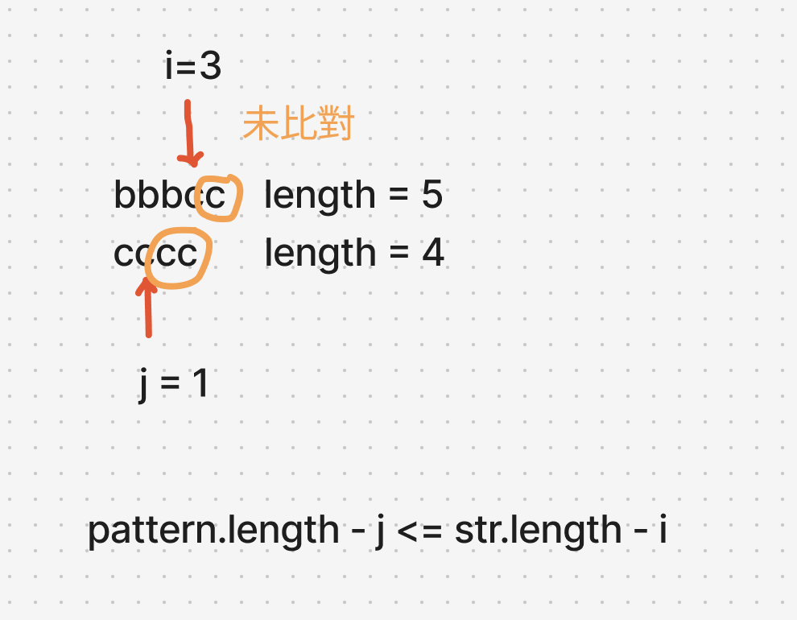

# 題目

https://leetcode.com/problems/find-the-index-of-the-first-occurrence-in-a-string/description/

# 開始分析

- 本題目背後的核心概念
  - 要不要以暴力解為基礎？
  - 字串比對如何優化？
    - 減少重複匹配
    - 優化結束時機
- 如何從問題推導出使用的解題工具
  - 熟悉 KMP，若用暴力解過不了則用 KMP
- 如何推導出最優複雜度
  - 至少需要 string 和 pattern 都過一遍，最少為 m+n

## 如何解釋解題思路


### 暴力解
暴力解很直覺，嘗試把 haystack 的每個字元當作開頭嘗試比對一次 needle，並回傳第一次比對成功的位置。如果最終都沒有比對成功則回傳 -1。時間複雜度為 O(mn)

方法簡單但有一個可以延伸討論的優化方式是，什麼時候比對結束？最簡單是永遠嘗試到到最後一個字元為止。但若透過觀察（如下圖）可以發現，string 剩餘的未比對字元根本不足，就算全部比對成功，也達不到匹配成功。所以最低限度是不是至少要有足夠的字元去匹配？

- Ａ：未匹配 string：string.length - i
- Ｂ：未匹配 pattern：pattern.length - j

至少Ａ要大於等於Ｂ才有比對的意義。
##### 經分析後，本題詳細步驟如下：

1. 遍歷每一個字元，直到剩餘字元不足以匹配成功
2. 每次遍歷，以該字元當作開頭頭字元，檢查 substring 是否和 pattern 完全相等
3. 若相等，回傳開頭字元位置
4. 若不相等，繼續下一次遍歷

#### 程式碼

- Javascript

```js
/**
 * @param {string} haystack
 * @param {string} needle
 * @return {number}
 */
var strStr = function (haystack, needle) {
  for (let start = 0; start <= haystack.length - needle.length; start++) {
    let i = start, j = 0;
    while (i < haystack.length && j < needle.length) {
      if (haystack[i] !== needle[j]) break;
      i++;
      j++;
    }
    if (j === needle.length) return start;
  }
  return -1;
};
```
haystack 長度 n, needle 長度 m  
時間複雜度：最差情況需要 n 個字元做開頭，匹配 m 次 ->O(nm)  
空間複雜度：O(1)

### KMP

#### 程式碼

- Javascript

```js
/**
 * @param {string} haystack
 * @param {string} needle
 * @return {number}
 */
/**
 * @param {string} haystack
 * @param {string} needle
 * @return {number}
 */
var strStr = function (haystack, needle) {
  const getPrefixSuffixTable = (pattern) => {
    let i = 1, compareEnd = 0;
    const match = [0];
    while (i < pattern.length) {
      if (pattern[i] === pattern[compareEnd]) {
        match[i] = compareEnd + 1;
        i++;
        compareEnd++;
      } else if (compareEnd === 0) {
        match[i] = 0;
        i++;
      } else {
        compareEnd = match[compareEnd - 1];
      }
    }
    return match;
  };

  const lsp = getPrefixSuffixTable(needle);
  let i = 0,
    j = 0;
  while (i < haystack.length) {
    if (haystack[i] === needle[j]) {
      i++;
      j++;
    } else if (j === 0) {
      i++;
    } else {
      j = lsp[j - 1];
    }
    if (j === needle.length) return i - j;
  }
  return -1;
};
```
haystack 長度 n, needle 長度 m  
時間複雜度：創建 LPS 需要 m 時間，針對 haystack 的指標永不會退回，需要 n 時間 -> O(n+m)
空間複雜度：需創建 needle 的 prefix-suffix table -> O(m)
