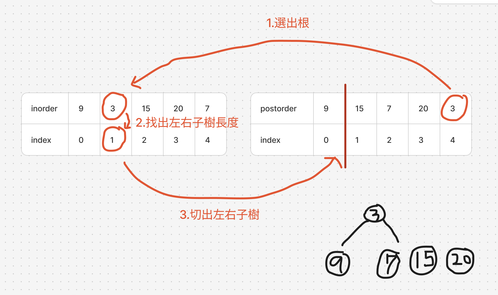

# 題目

https://leetcode.com/problems/construct-binary-tree-from-inorder-and-postorder-traversal/description/

# 開始分析

- 本題目背後的核心概念
  - 如何從遍歷順序反向建構出樹？
  - 用何種遍歷方法？DFS，且要用後序遍歷的方式，先創建孩子，父母再指向它們
  - BFS 難以紀錄父母和路徑，創建節點後不知道父母是誰不好處理
- 如何從問題推導出使用的解題工具
  - `中序`遍歷加上任一遍歷（前序或後序），可以建構唯一樹
- 如何推導出最優複雜度
  - 在中序數列找切點的時候，所有數字都會當一遍切點，時間複雜度為 O(n)
    - 尋找切點可以用雜湊表優化至 O(1)
  - 最差情況下，建構深度為 n 的不平衡二元樹時，需要 O(n) 的 call stack

### DFS

##### 如何解釋解題思路
經過觀察，**後序**遍歷數列的最後一個數字，一定是整個樹的根。而觀察**中序**遍歷數列，只要知道根，就可以以根為切點，分割出左右子樹。

分割出左右子樹後，既然知道左、右子樹各自的長度，又可以回到後序遍歷序列找出左右字子樹。至此第一層的根、左、右子樹分割完成。

通過觀察之結論以 DFS 完成遞迴建構唯一樹，首先用遞迴三定義：
1. 定義輸入輸出：輸入為 inorder數列、postorder 數列，輸出為建構完成之樹根
2. 定義終止條件：若樹的長度為 0 則終止
3. 定義具體邏輯：找到樹根 -> 切出左右子樹的 inorder、postorder-> 遞迴建構左子樹和右子樹

如果沒有圖解這題不好具象化。請看圖： 


##### 經分析後，本題詳細步驟如下：
以遞迴建構出唯一樹，每次遞迴
1. 依據傳入之 postorder 找出根
2. 依據根之值在 inorder 找出切點
3. 切 inorder 和 postorder，各自切出左右數列
4. 以 left-inorder + left-postorder 執行遞迴建構出左子樹
5. 以 right-inorder + right-postorder 執行遞迴建構出右子樹
6. 指標指向對應子樹後，回傳根。

時間複雜度：O(n)  
空間複雜度：O(n)

#### 程式碼

- Javascript

```js
/**
 * @param {number[]} inorder
 * @param {number[]} postorder
 * @return {TreeNode}
 */
var buildTree = function (inorder, postorder) {
  const indexMap = inorder.reduce((acc, cur, i) => {
    acc[cur] = i
    return acc
  }, {})

  const build = (starti, endi, startp, endp) => {
    if (starti >= endi) return null;
    const curVal = postorder[endp - 1];
    const index = indexMap[curVal]
    const leftStarti = starti;
    const leftEndi = index;
    const rightStarti = index + 1;
    const rightEndi = endi;

    const leftStartp = startp;
    const leftEndp = leftStartp + leftEndi - leftStarti;
    const rightStartp = leftStartp + leftEndi - leftStarti;
    const rightEndp = endp - 1;

    const leftNode = build(leftStarti, leftEndi, leftStartp, leftEndp);
    const rightNode = build(rightStarti, rightEndi, rightStartp, rightEndp);
    const root = new TreeNode(curVal, leftNode, rightNode);
    return root;
  };

  return build(0, inorder.length, 0, postorder.length);
};
```
