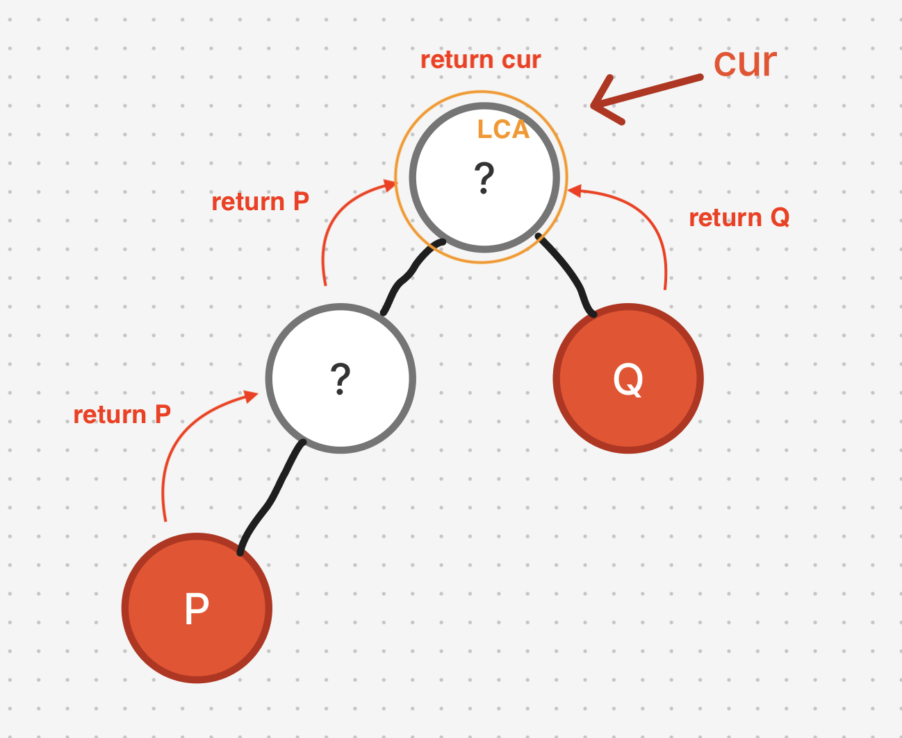
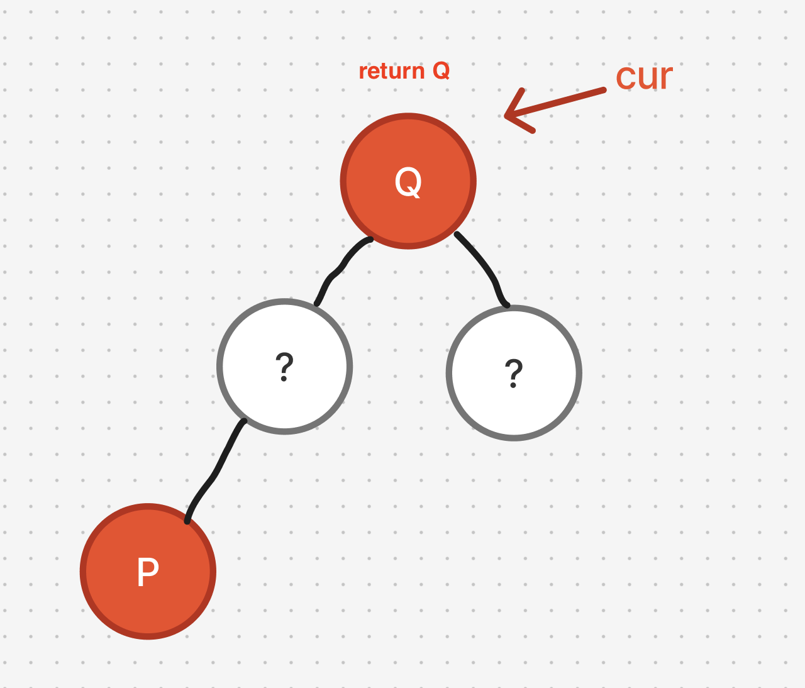
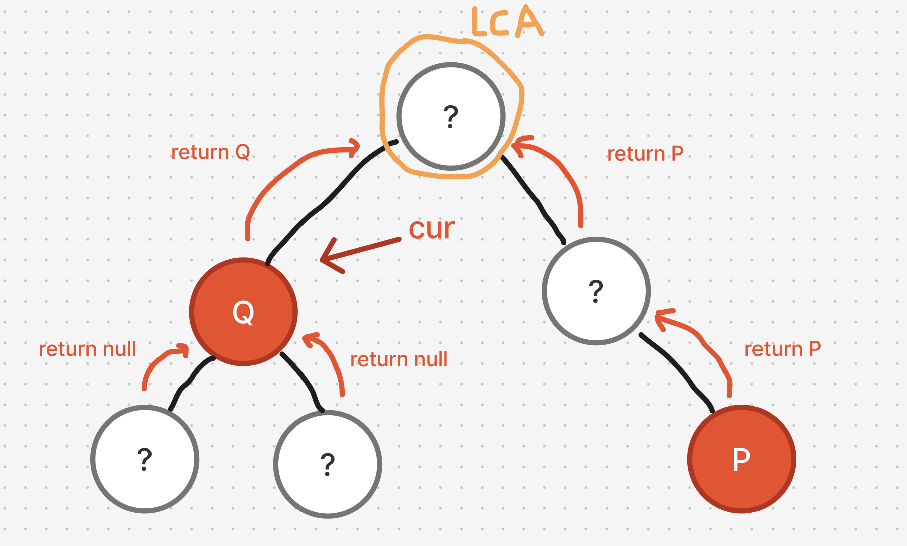

# 題目

https://leetcode.com/problems/lowest-common-ancestor-of-a-binary-search-tree/description/

# 開始分析

- 本題目背後的核心概念
  - 用何種方式遍歷？用 DFS ＋後序遍歷，可以知道孩子們有沒有含 p or q，藉此判斷目前是不是公共祖先
  - 要如何建構出指向父母的指針？建構後能否使用快慢指針尋找交點(LCA)
- 如何從問題推導出使用的解題工具
  - 要理解最小公共祖先(LCA)的定義
  - 快慢指針可以用在鏈結找環、環的交點、尋找 LCA 交點等等的題目
- 如何推導出最優複雜度
  - 遍歷所有節點找尋 p, q -> O(n)
  - 不需要額外空間 -> O(1)

### DFS

##### 如何解釋解題思路

用後序遍歷先檢查子樹們是否含 p/q。  
最直覺找到答案的情況，就是左子樹含 p 或 q，右子樹含另外一個，如圖。

但其實還有另一種情況，若目前節點為 p/q 之一，那自己即為最小公共祖先(LCA)，如圖。

或是目前節點 cur 下的子樹只有一個 p/q，另外一個根本在另外一個樹中


當然，窮舉以上所有例子，也能得出正確答案。

但遞迴問題如果能透過觀察定義輸入與輸出會有更清晰的邏輯。
試考慮，若輸入為任意節點，要回傳其子樹的公共祖先嗎？那如果只找到 p/q 其一，要回傳什麼？什麼都沒找到又要回傳什麼？

經過分析，將輸出定義為子樹中「可能是最小公共祖先的節點」邏輯最清晰。  
而「可能是最小公共祖先的節點」，則定義為滿足下列條件其一：

1. `cur === q || cur === p`
2. 左子樹、右子樹各含 p/q 之一

此時我們再回頭看上面三張圖。爲什麼回傳q，為什麼回傳 p，又為什麼回傳 cur? 邏輯就很清晰了。  
滿足以上兩條件的就回傳目前節點，否則就看看子樹有沒有可能是公共祖先的，有就回傳它。沒有就真的沒有了。

而經過遞迴最終得到的就是可能是最小公共祖先(LCA)的節點，可以說，如果該樹存在LCA，那就一定是該節點。而依據題目限制，我們可以知道給的測資必定存在LCA的，因此該節點為答案。

利用遞迴三定義建構出演算法框架：
1. 定義輸入輸出：輸入某根節點，回傳該樹「可能」為 p/q 的最小公共祖先(LCA)，若沒有則回傳空
2. 定義終止條件：根為空，或是找到可能為LCA的節點
3. 定義具體邏輯：
    - 檢查目前節點是否可能是LCA，有的話回傳
    - 若沒有，遞迴檢查左右子樹是否有可能是LCA的節點，有的話回傳。
4. 遞迴結束，回傳答案


##### 經分析後，本題詳細步驟如下：
遞迴遍歷所有節點，每次遞迴：
1. 檢查目前節點是否是 p/q 之一，是則回傳目前節點
2. 遍歷左、右子樹，若皆含 p/q之一，是則回傳目前節點
3. 若只有某一子樹可能含LCA，回傳該「有可能」之節點

時間複雜度：遍歷所有節點：O(n)  
空間複雜度：創建新樹：O(n)

#### 程式碼

- Javascript

```js
var lowestCommonAncestor = function (root, p, q) {
  if (!root) return null;
  if (root === p || root === q) return root;
  const leftLCA = lowestCommonAncestor(root.left, p, q);
  const rightLCA = lowestCommonAncestor(root.right, p, q);
  if (leftLCA && rightLCA) return root;
  return leftLCA || rightLCA;
};
```
