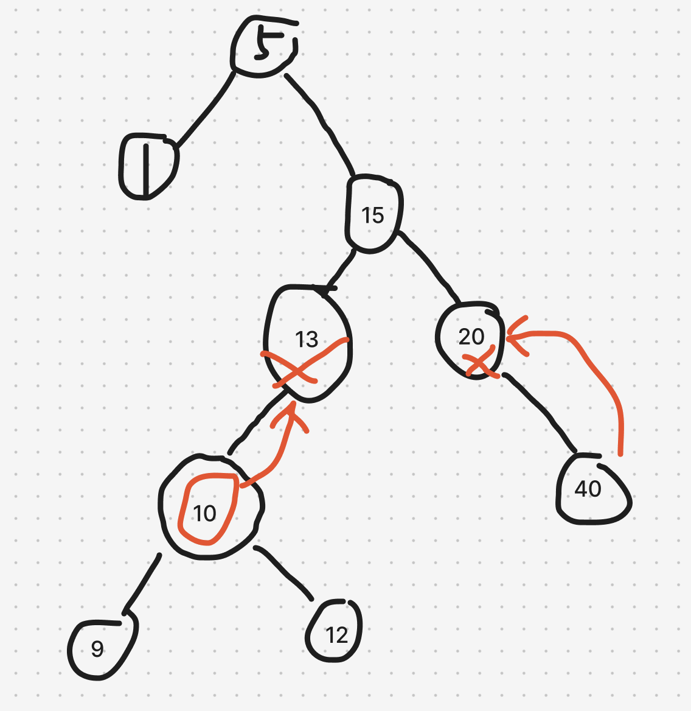
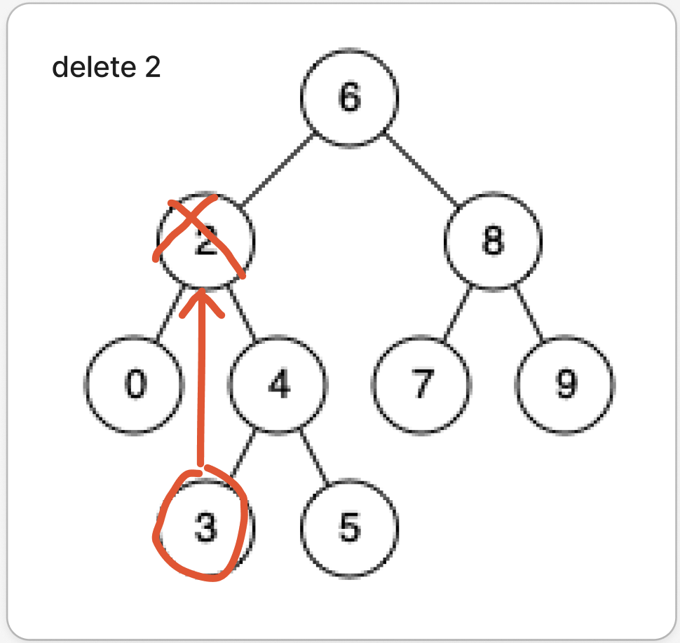
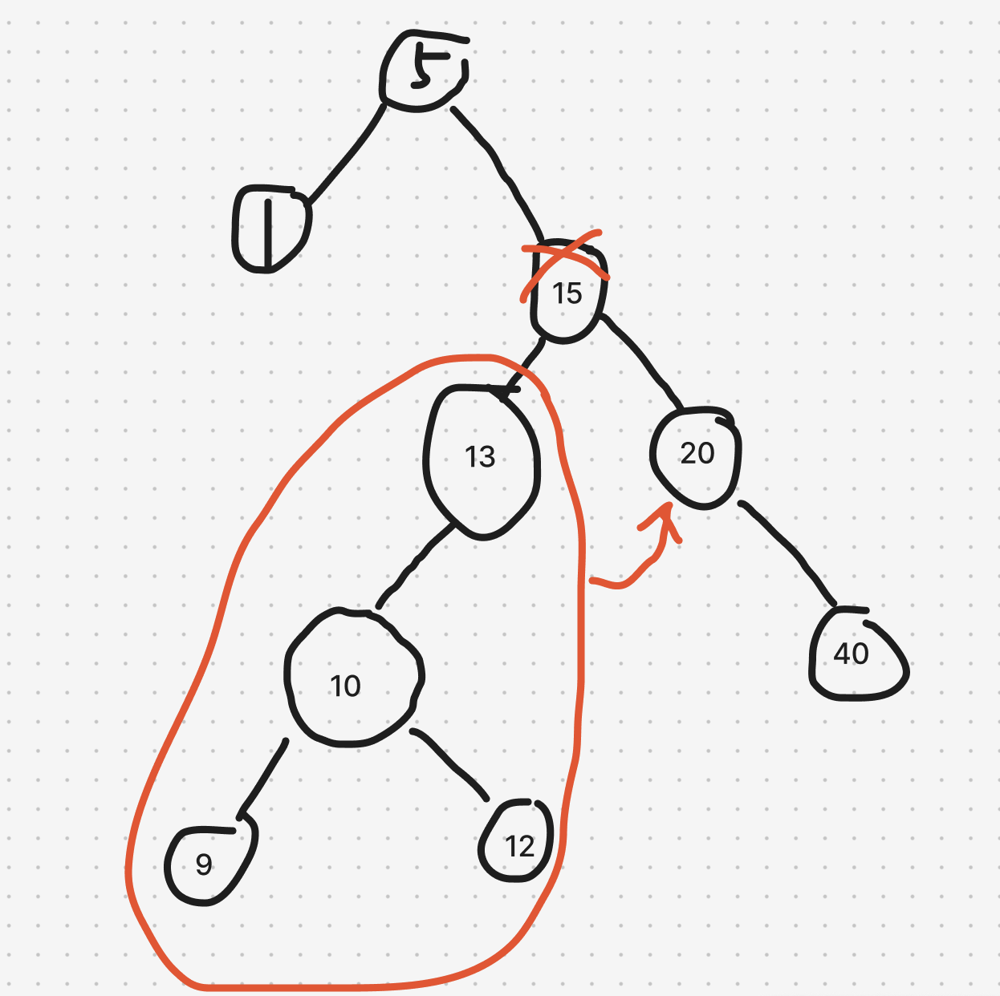

# 題目

https://leetcode.com/problems/delete-node-in-a-bst/

# 開始分析

- 本題目背後的核心概念
  - 如何刪除節點且不違反 BST 的規則？刪除的方式不只一種，以下會示範兩種最簡單的
    1. 節點替代：刪除後找值最接近節點來補
    2. 子樹嫁接：刪除後用左子樹替代，右子樹嫁接在左子樹尾端，反之亦可。
  - 遍歷方式：前序遍歷，找到節點後直接操作，不需要子節點們的資訊
- 如何從問題推導出使用的解題工具
  - 經典的 BST 刪除操作有哪些方式？如何刪除、新增、修改後仍然維持 BST 的特性？
- 如何推導出最優複雜度

### 節點替代

##### 如何解釋解題思路

兩種解法都圍繞一個規則 — **若刪除節點只有單邊子樹，則子樹可以直接補上**。如下圖。
因為 13 或 20 都只擁有單邊子樹，若該節點刪除，子樹能直接補上且仍符合規則。
原因細品，若僅看父母，由於 13 節點位置的允許範圍是 5 ~ 15，而 13 左孩子的範圍是 5 ~ 13，因此子集合補進超集合不違反規則。對於節點 20 同理。

理解上述規則後，來講刪除節點的概念，策略是刪除節點後找擁有接近值的節點來補上，因為缺有人補了，所以不用動到結構，這解法比較直覺。

舉例來說，若有節點[1,2,3,4,5]，刪掉 4，可以找數值接近的 3 或 5 補上，至於要往下找 3 還是往上找 5 都可以，都符合規則。

如下圖，我們將 2 節點的值設為 3，然後刪掉節點 3 即可。若 3 有小孩就用上述的方法（3 只可能有單邊子樹，否則不可能是最接近 2 的值，畫個圖就知道了）


利用遞迴三定義：

1. 定義輸入輸出：傳入根節點，與目標值，回傳新的根節點
2. 定義終止條件：根為空、沒孩子、或僅有單邊子樹
3. 定義具體邏輯：尋找擁有接近值的節點後，和目標節點交換值，並遞迴刪除該節點。

##### 經分析後，本題詳細步驟如下：

遞迴所有子樹，每次遞迴

1. 比對是否為目標節點，若找到，且目標
   - 沒孩子，回傳 null
   - 僅有單邊子樹，回傳該子樹
   - 擁有左右子樹，則往右子樹找最小值作為接近節點，找到後用來取代目標節點後。遞迴刪除該接近節點後，原地回傳根。
2. 若沒找到目標，遞迴左右子樹。

時間複雜度：樹高度為 h，找到目標節點＋刪除總共 -> O(h)
空間複雜度：沒用額外空間 O -> (1)

#### 程式碼

- Javascript

```js
var deleteNode = function (root, key) {
  if (!root) return null;
  if (root.val === key) {
    if (!root.left) return root.right;
    // 往左找最大值節點
    let max = root.left;
    while (max.right) max = max.right;
    root.val = max.val; // 取代目前節點
    root.left = deleteNode(root.left, max.val);
  } else if (key > root.val) root.right = deleteNode(root.right, key);
  else root.left = deleteNode(root.left, key);
  return root;
};
```

### 子樹嫁接

##### 如何解釋解題思路

承上觀念 — **若刪除節點只有單邊子樹，則子樹可以直接補上**。
處理兩邊都有子樹，嫁接更簡單暴力，原有結構會被破壞，可能導致樹不平衡，但是沒有邊緣情況要考慮。看完圖就懂了。

直接把15刪掉，左子樹整顆嫁接成右子樹最小的節點左孩子，完事。

##### 經分析後，本題詳細步驟如下：

1. 比對是否為目標節點，若找到，且目標
   - 沒孩子，回傳 null
   - 僅有單邊子樹，回傳該子樹
   - 擁有左右子樹，則往右子樹找最小節點，將左子樹移過去（成為最小節點的左子樹）
2. 若沒找到目標，遞迴左右子樹。

時間複雜度：樹高度為 h，找到目標節點＋找到右子樹最小值總共 -> O(h)  
空間複雜度：沒用額外空間 O -> (1)

#### 程式碼

- Javascript

```js
var deleteNode = function (root, key) {
  if (!root) return null;
  if (root.val === key) {
    if (!root.right) return root.left;
    let min = root.right;
    while (min.left) min = min.left;
    min.left = root.left;
    return root.right;
  }
  root.right = deleteNode(root.right, key);
  root.left = deleteNode(root.left, key);
  return root;
};
```
