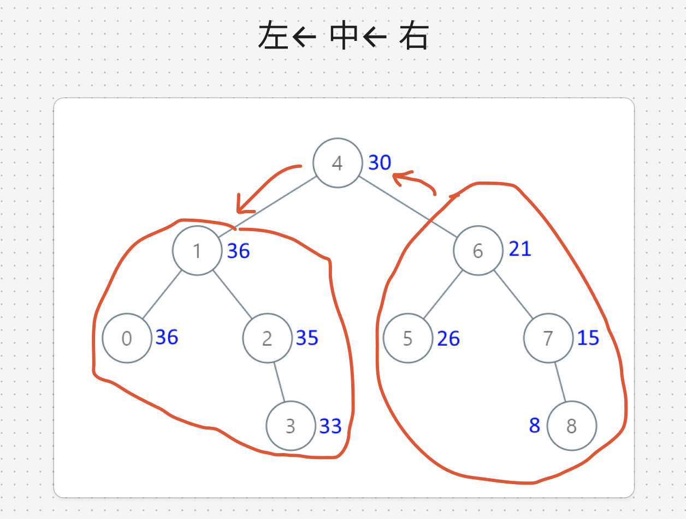

# 題目

https://leetcode.com/problems/convert-bst-to-greater-tree/description/

# 開始分析

- 本題目背後的核心概念
  - 用何種方式遍歷？先遍歷右子樹，以回傳值處理完根後，再傳給左子樹，順序是「右 -> 根 -> 左」，是反向的中序遍歷。
- 如何從問題推導出使用的解題工具
  - **背**：中序遍歷特性，按照 BST 的定義，遍歷順序是由小到大的順序
- 如何推導出最優複雜度
  - 時間複雜度：遍歷所有節點 -> O(n)
  - 空間複雜度：需要存一個累計值 -> O(1)

### DFS

##### 如何解釋解題思路

分析遍歷順序時，透過觀察，發現要處理根節點，需要回傳右子樹的累計值，這是後序遍歷的特性。
但再將視野往左移，會發現要處理左子樹，需要先知道根的累計值，這就和後序遍歷的順序相違背。



因此正確的遍歷順序應該是 `右 -> 根 -> 左`

另一種思路是，已知中序遍歷BST會由小至大，那過來不就會由大至小，此題正是由大累積到小。

##### 經分析後，本題詳細步驟如下：
遞迴遍歷所有節點，每次遞迴
1. 把目前節點的值加進去累計值
2. 用累計值取代目前節點的值
遍歷結束，回傳根節點

時間複雜度：O(n)  
空間複雜度：O(1)

#### 程式碼

- Javascript

```js
var convertBST = function (root) {
  let sum = 0;
  const traverse = (node) => {
    if (!node) return null;
    traverse(node.right);
    sum += node.val;
    node.val = sum;
    traverse(node.left);
  };
  traverse(root);
  return root;
};
```
